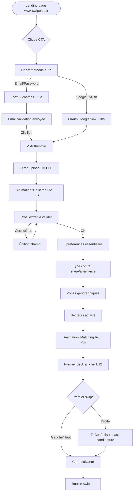
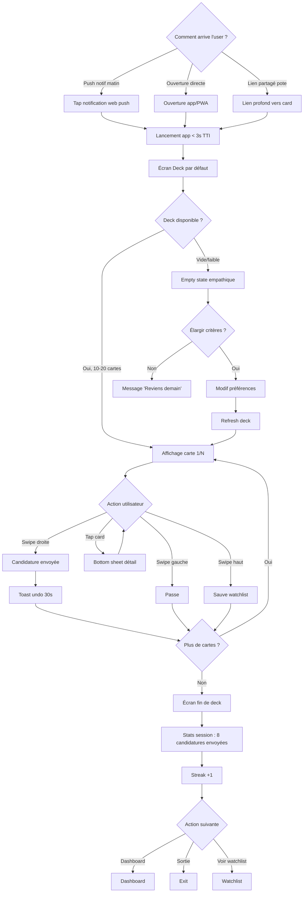
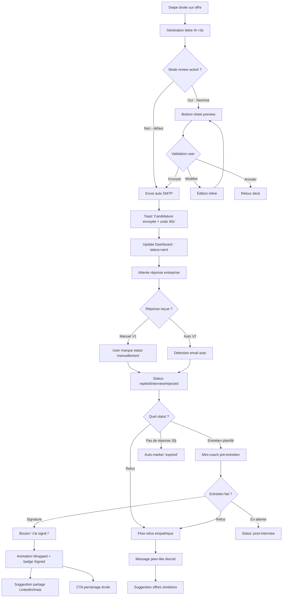
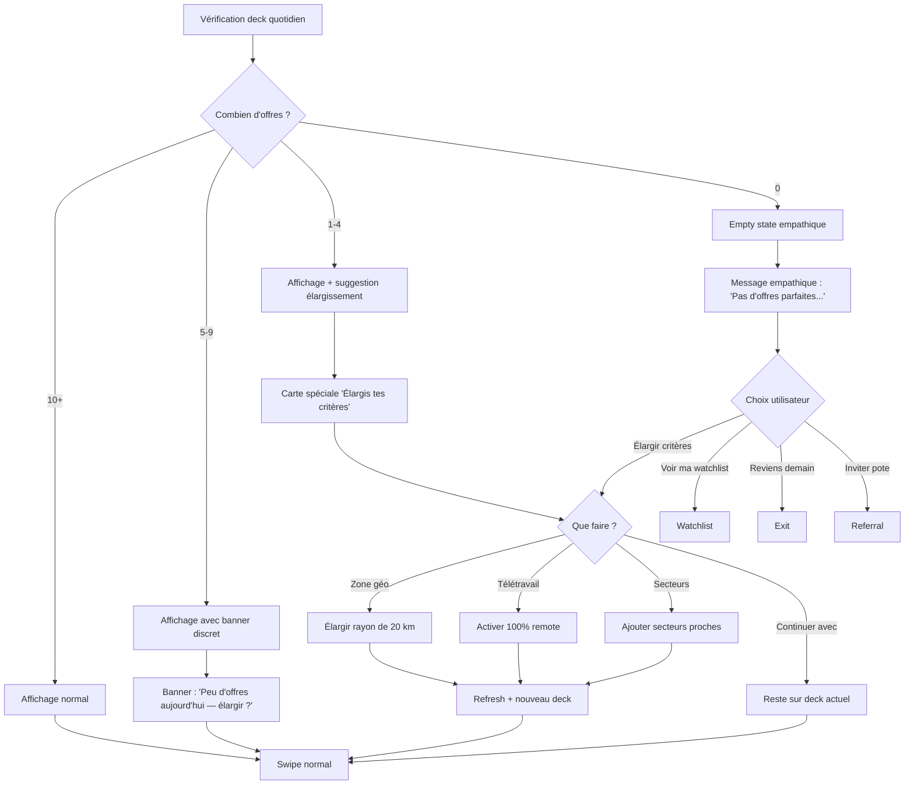
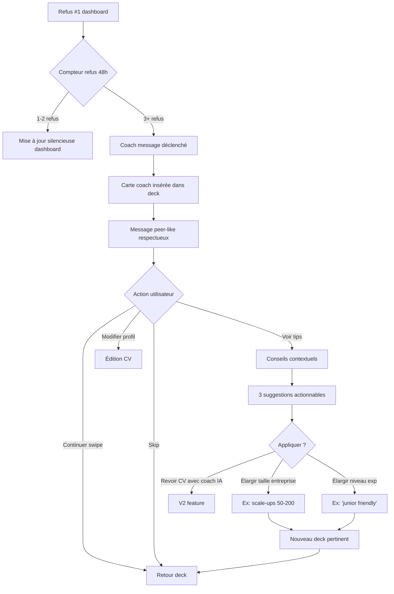

# UX Design Specification — SwipeJob

**Author:** Daniil
**Date:** 2026-05-14

<!-- UX design content will be appended sequentially through collaborative workflow steps -->

## Executive Summary

### Project Vision

SwipeJob est une web app mobile-first PWA qui transforme la recherche d'alternance et de stage en une expérience swipe quotidienne, addictive et efficace pour les étudiants français Gen Z. L'utilisateur crée un profil une seule fois, puis swipe 5 minutes par jour des offres pré-matchées par IA — swipe droite = candidature envoyée automatiquement avec lettre IA personnalisée, swipe gauche = passe. L'UX doit faire vivre la promesse marketing "Trouve ton alternance en swipant, sans rédiger une lettre", dès la première seconde d'utilisation.

### Target Users

Trois personas représentatives de la cible :

- **Léa, 21 ans, M1 communication, Sciences Po Lyon** — utilisatrice cible idéale. Recherche active d'alternance M2 (rentrée septembre). Attentes UX type Tinder/BeReal. Échec émotionnel des plateformes desktop. Critère de succès UX : qu'elle envoie sa première candidature en <3 minutes après inscription et y revienne quotidiennement pendant sa recherche.
- **Tom, 19 ans, BTS SIO Informatique, banlieue Toulouse** — débutant, peu d'options locales, vit chez ses parents, pas de réseau pro. Découragé par les plateformes existantes. Critère de succès UX : que l'app ne le décourage PAS (zéro implicit rejection), valorise son profil, propose des élargissements intelligents.
- **Yasmine, 22 ans, école d'ingé INSA Paris** — top profil exigeant. Sceptique vis-à-vis des "apps à swipe pour ados". Vise des entreprises ultra-sélectives. Critère de succès UX : qualité visuelle premium, ton respectueux, confidentialité du canal côté recruteur, pédagogie matching sans paternalisme.

### Key Design Challenges

1. **Swipe tactile fluide sur web mobile** — l'interaction signature doit être indistinguable d'une app native (60 FPS, gestes physiques, animation cards stack). Sans cela, l'expérience s'effondre dès la première seconde. C'est le défi #1 et le différenciateur #1.
2. **Onboarding ultra-rapide mais qualifiant** — sous 90 secondes : OAuth + upload CV + parsing IA + 3 préférences essentielles + premier deck. Risque d'abandon : 40-50% au-delà.
3. **Transparence du matching IA sans surcharge cognitive** — chaque carte révèle son score et ses raisons en micro-interaction non bloquante. Tonalité : peer-like, pas condescendante.
4. **Gestion émotionnelle des situations négatives** — deck vide (Tom), refus en série (Yasmine), candidatures sans réponse (tous). L'UX du "non" est plus discriminante que celle du "oui" — c'est là que les utilisateurs partent.
5. **Confidentialité du canal côté recruteur** — l'email de candidature ne doit pas révéler "envoyé via SwipeJob" pour préserver la perception de sérieux côté entreprise. Cela contraint plusieurs choix d'identité visuelle.
6. **Diversité des profils sans complexifier l'UX** — Léa (générale), Tom (débutant), Yasmine (exigeante) ont des besoins différents (densité d'info, ton, préférences avancées). L'UX doit s'adapter sans menu de configuration intimidant.
7. **Conformité WCAG 2.1 AA sans sacrifier l'animation** — gestes swipe accessibles via clavier/boutons, respect prefers-reduced-motion, lecteurs d'écran fluides sur le deck.

### Design Opportunities

1. **L'animation de swipe comme signature de marque** — physique réaliste des cards, feedback haptique (où supporté), confettis au swipe droit, sound design optionnel. Différenciateur instantanément visible vs LinkedIn/JobTeaser.
2. **Pédagogie du matching comme outil de confiance** — chaque carte montre 1-2 raisons du score ("Python + Python ✓"). Transforme l'IA "black box" en coach transparent. Unique sur le marché FR du recrutement étudiant.
3. **Tonalité empathique distinctive** — messages contextuels respectueux après refus, pénurie, attente. "Coach discret" plutôt que "notification froide". Crée un attachement émotionnel.
4. **Gamification douce mais valorisante** — streaks, badges de jalon (premier match, première signature), pas de competition agressive. Inspiration : Duolingo (positivité), pas Candy Crush (manipulation).
5. **Identité visuelle Gen Z 2026** — moderne, mobile-native, française sans clichés ringards. Référence : Hinge (sophistication), BeReal (authenticité), Le Slip Français (FR moderne assumée).
6. **PWA = absence de friction d'installation** — vs apps natives qui imposent app store + permissions. Stratégie d'acquisition : un lien partagé sur WhatsApp/Instagram = un utilisateur en 10 secondes.
7. **Mini-coach pré-entretien = surprise positive** — fonctionnalité non-attendue par les utilisateurs sur ce type d'app. Renforce la valeur perçue au moment critique.

## Core User Experience

### Defining Experience

L'expérience cœur de SwipeJob tourne autour d'**UN seul geste** : le swipe sur une carte d'offre.

- **Swipe droite** = candidature envoyée automatiquement avec CV et lettre IA personnalisée
- **Swipe gauche** = passe (l'offre disparaît du deck)
- **Swipe haut** = sauvegarde pour plus tard

Ce geste unique est la **boucle de valeur fondamentale**. Si le swipe est imparfait (lent, peu fluide, pas physique), tout le produit s'effondre. Si le swipe est parfait (60 FPS, gestes naturels, feedback immédiat), 80 % de la promesse produit est tenue dès la première seconde.

Le reste de l'app (onboarding, dashboard, notifications, profil) sert ce moment central. Aucune interaction secondaire ne doit prendre plus de place visuelle ou cognitive que le swipe.

### Platform Strategy

**Web app PWA mobile-first** déployée sur deux domaines :

- `app.swipejob.fr` — SPA authentifiée (l'expérience swipe + dashboard + profil)
- `www.swipejob.fr` — site marketing SSR/SSG pour acquisition SEO

**Stratégie de plateforme :**

- **Mobile-first absolu** : design pensé pour 360-430 px, puis élargi vers tablette/desktop.
- **Touch-first** : tous les gestes (swipe, tap, long-press) en natif tactile. Fallback clavier (flèches) et boutons sur desktop pour accessibilité et tablette posée.
- **Pas d'app store** en V1 : la PWA s'installe en un clic depuis le navigateur ("Ajouter à l'écran d'accueil"). Zéro friction d'installation = stratégie d'acquisition virale.
- **Offline partiel** : le deck du jour est pré-chargé via service worker pour permettre le swipe dans le métro (envoi des candidatures différé à la reconnexion).
- **Web Push notifications** : rappel quotidien matinal "🎯 5 nouvelles offres pour toi" (web push API, support iOS 16.4+ et Android Chrome).
- **Pas de WebSocket V1** : pas de temps réel critique ; polling 60s pour le dashboard.
- **Wrapper natif Capacitor** envisagé en V2/V3 uniquement si la traction confirme un besoin d'app store.

### Effortless Interactions

Les interactions où l'utilisateur **ne doit jamais réfléchir** :

1. **Inscription** — OAuth Google en un clic. Pas de mot de passe à inventer, pas d'email à vérifier.
2. **Création du profil** — upload du CV PDF, l'IA extrait tout (école, compétences, expériences) en 8 secondes. L'utilisateur valide ou corrige, pas de saisie manuelle.
3. **Découverte des préférences** — 3 questions essentielles maximum (type contrat, zone géo, secteurs). Le reste sera affiné automatiquement à partir des comportements de swipe.
4. **Candidature** — un swipe droite. La lettre IA est générée, le CV est joint, l'email est envoyé. Aucune saisie de l'utilisateur, aucune validation par défaut.
5. **Rappel quotidien** — la notification push pousse l'utilisateur dans l'app. Pas besoin de "se souvenir de chercher".
6. **Suivi des réponses** — le dashboard se remplit tout seul (V1 : saisie manuelle assistée ; V2 : détection email automatique sur consentement).
7. **Désinscription d'une offre** — swipe gauche. Pas de menu, pas de confirmation.

### Critical Success Moments

Les moments où l'UX **doit absolument réussir** sous peine de perdre l'utilisateur :

1. **Premier swipe droite (T+3 min après signup)** — animation confettis, message "💌 Candidature envoyée", feedback haptique. C'est l'instant où l'utilisateur passe de sceptique à converti. Si ce moment est plat, il ne reviendra pas.
2. **Deuxième session (J+1 matin)** — la notification push doit ramener l'utilisateur, le deck du jour doit charger en <3s, et les premières cartes doivent paraître "pour lui". Échec ici = abandon définitif.
3. **Première réponse entreprise reçue (J+3 à J+10)** — l'utilisateur doit le voir immédiatement (push + dashboard update), avec un message empathique (positif si réponse positive, neutre et constructif si négatif).
4. **Pénurie d'offres (Tom)** — le moment où le deck est vide ou faible doit être transformé en opportunité ("Élargis ta zone ? Active le télétravail ?") plutôt que subi comme un échec.
5. **Refus en série (Yasmine)** — après 3 refus, l'app affiche un message coach respectueux sans paternalisme. Ton critique : peer-like, jamais condescendant.
6. **Premier entretien programmé** — l'utilisateur découvre par hasard le mini-coach pré-entretien (résumé entreprise + questions types). Surprise positive = ancrage de la valeur perçue.
7. **Signature reportée** — animation badge "Signed", incitation au parrainage. Moment de viralité.

### Experience Principles

Sept principes guident toutes les décisions UX :

1. **Un geste, un résultat** — chaque action utilisateur produit un effet immédiat et visible. Pas d'étape intermédiaire, pas de "valider", pas de confirmation modale.
2. **Mobile-first absolu** — toute décision design commence sur écran 390×844 (iPhone 14). Le desktop est une adaptation, pas la cible.
3. **Transparence du matching** — chaque score IA est expliqué en 1-2 lignes accessibles sans bloquer le swipe. L'IA est un coach visible, pas une boîte noire.
4. **Empathie peer-like** — le ton parle comme un grand frère / une grande sœur qui aurait réussi sa propre alternance. Jamais paternaliste, jamais infantilisant, jamais commercial.
5. **Feedback dopaminergique mesuré** — animations, micro-confettis, badges aux jalons. Mais jamais Candy Crush : pas de manipulation, pas de FOMO artificiel, pas de pop-ups intrusifs. Inspiration Duolingo.
6. **Dignité du canal** — l'utilisateur ne doit jamais avoir honte d'utiliser SwipeJob, et le recruteur ne doit jamais savoir que la candidature vient d'une "app à swipe". L'identité visuelle externe (emails, lettres) est sobre et professionnelle ; l'identité interne (in-app) est ludique et jeune.
7. **Accessibilité comme contrainte créative** — WCAG 2.1 AA dès le design, pas en rattrapage. Tous les gestes ont un équivalent clavier et bouton visible. Le mode "reduced-motion" préserve l'expérience sans animations.

## Desired Emotional Response

### Primary Emotional Goals

SwipeJob doit provoquer **3 émotions primaires** distinctes, qui se renforcent mutuellement :

1. **Soulagement** — l'utilisateur ressent immédiatement que la recherche d'alternance est moins épuisante qu'avant. Le poids cognitif et émotionnel diminue dès le premier swipe. C'est l'émotion la plus différenciante vs LinkedIn / HelloWork qui génèrent du stress.
2. **Empowerment (sentiment de pouvoir agir)** — l'utilisateur se sent valorisé, capable, en contrôle. L'IA travaille POUR lui, pas contre lui. Sa candidature est envoyée en un geste, son CV est compris, ses préférences sont respectées.
3. **Optimisme** — il y a un horizon. Les opportunités existent, l'app les met à portée de swipe, le système croit en l'utilisateur. C'est l'antidote à la démoralisation typique de la recherche d'alternance.

**L'émotion qui pousse à recommander à un pote :** soulagement + empowerment combinés. "Sérieux, regarde ce truc, c'est tellement plus simple."

**L'émotion à éviter absolument :** la **honte sociale** d'utiliser une "app à swipe pour trouver un job". L'utilisateur doit être fier de dire "oui, je l'ai trouvé sur SwipeJob", pas devoir s'excuser.

### Emotional Journey Mapping

L'arc émotionnel de l'utilisateur traverse 7 étapes :

| Étape | Moment | Émotion cible | Émotion à éviter |
|---|---|---|---|
| 1. Découverte | Landing page, post réseau social | Curiosité, scepticisme léger (sain) | Méfiance, condescendance perçue ("encore une app gadget") |
| 2. Inscription | Signup + upload CV | Surprise positive ("c'est si rapide ?") | Friction, anxiété (CV jugé, formulaire long) |
| 3. Premier deck | Affichage des 10-20 premières cartes | Anticipation, intrigue ("c'est qui ?") | Déception (deck vide, pertinence faible) |
| 4. Premier swipe droite | Animation confettis + candidature envoyée | Délice, dopamine, étonnement ("c'est tout ?!") | Doute ("ça a vraiment envoyé ?"), anxiété (j'aurais dû relire) |
| 5. Routine quotidienne | Sessions J+1 à J+30 | Habitude positive, légère anticipation | Lassitude, FOMO, culpabilité ("trop de candidatures") |
| 6a. Première réponse positive | Notification + dashboard | Excitation, validation | (rien à éviter, c'est la fête) |
| 6b. Premier refus ou non-réponse | Dashboard ou push | Acceptation, calme, continuité | Démolition, isolement, auto-blâme |
| 7. Signature | Bouton "J'ai signé !" + badge | Fierté, gratitude, viralité | (rien à éviter) |

### Micro-Emotions

Sept micro-émotions critiques à orchestrer en permanence :

- **Confiance** plutôt que confusion → toujours expliquer pourquoi cette offre, comment ce score est calculé, où va ma candidature.
- **Trust** plutôt que skepticisme → tonalité honnête, pas de marketing gonflé, transparence totale sur l'IA et les données.
- **Excitement maîtrisé** plutôt qu'anxiété → animations à 60 FPS, mais jamais de notifications anxiogènes ("Plus que 2 jours pour candidater !"), pas de countdown artificiel.
- **Accomplissement** plutôt que frustration → chaque action produit un résultat visible. Aucune erreur silencieuse, aucun "loading" sans feedback.
- **Délice** plutôt que satisfaction tiède → micro-interactions soignées, sounds optionnels, haptics où supportés. Le swipe doit être physiquement plaisant.
- **Appartenance** plutôt qu'isolement → coach empathique en cas de refus, mention "des étudiants comme toi ont aussi candidaté à cette offre" (sans pression).
- **Dignité** plutôt que honte → l'identité visuelle, le ton et les copys externes (lettres, emails) doivent être sobres et pros. Pas de "envoyé via SwipeJob 🚀" en signature.

### Design Implications

Chaque émotion ciblée se traduit en décisions UX concrètes :

| Émotion cible | Décisions UX qui la créent | Anti-pattern à interdire |
|---|---|---|
| **Soulagement** | Tunnel d'onboarding court, candidature en 1 geste, dashboard pré-rempli, notifications limitées et opt-in | Tutoriels longs, validation à chaque étape, mots de passe complexes, formulaires obligatoires |
| **Empowerment** | Score matching expliqué, préférences ajustables à chaud, undo de candidature 30s, accès profil/données toujours visible | Boîte noire IA, défauts opaques, dark patterns, déconnexion forcée |
| **Optimisme** | Messages contextuels positifs ("3 nouveaux matchs ce matin"), badges de progression, visualisation des candidatures envoyées | Compteurs de refus visibles, mise en évidence des échecs, comparaison avec d'autres |
| **Trust** | Politique de confidentialité accessible en 1 clic, mention claire des sources d'offres, audit log des décisions IA | Termes juridiques cachés, opt-in à des trucs non liés, publicité interne, vendeur de profils |
| **Délice** | Animation cards 60 FPS, confettis premier swipe droit, badge "Signed" éclatant, polices et couleurs vivantes | Loaders en blocage, animations saccadées, sons agressifs, vibration sans contrôle |
| **Dignité** | Lettre IA dans le style "pro classique", email recruteur sans branding SwipeJob, paramètres "mode discret" pour cacher la marque dans les communications externes | Signature SwipeJob dans les emails, mention de l'app dans la lettre, suggestion "Dis-leur que tu viens de SwipeJob" |
| **Accomplissement** | Animation après envoi candidature, son optionnel, sensation de validation immédiate, dashboard mis à jour en temps réel | Confirmation par modale, message "Veuillez attendre", spinner sans contexte |

### Emotional Design Principles

Cinq principes émotionnels qui surplombent toutes les décisions UX :

1. **Le calme est le luxe ultime** — la recherche d'alternance est déjà stressante. L'app doit être un sanctuaire émotionnel, pas un amplificateur d'anxiété. Pas de countdowns, pas de notifications urgentes, pas de pression au volume.
2. **Le délice est dans les détails** — micro-animations, micro-textes, micro-sons. Ce sont les 5 % de la surface UX qui créent 80 % de l'attachement émotionnel.
3. **L'empathie n'est pas optionnelle** — chaque message d'erreur, chaque écran de pénurie, chaque refus doit être écrit comme par un pote qui comprend, pas par un robot qui informe.
4. **L'IA est un coach visible et bienveillant** — jamais cachée, jamais paternaliste. Quand l'IA prend une décision (matching, lettre, suggestion), l'utilisateur le sait et comprend pourquoi.
5. **La dignité protège la rétention** — un utilisateur qui a honte d'utiliser le produit ne reviendra pas et ne le recommandera pas. Tout choix d'identité visuelle, ton, copy doit passer le test "est-ce que Yasmine peut en parler fièrement à un recruteur ?".

## UX Pattern Analysis & Inspiration

### Inspiring Products Analysis

#### 1. Tinder / Hinge — La référence du swipe

**Ce qu'ils font excellemment :**

- Le geste de swipe est physique, fluide, satisfaisant (60 FPS, animation de carte qui rétroviron quand on swipe puis revient si on hésite).
- Le deck est limité (Tinder = 100 swipes/jour gratuit), ce qui crée un sentiment de rareté et incite à la qualité plutôt qu'à la quantité.
- Hinge va plus loin que Tinder en montrant **pourquoi un match est suggéré** (réponses à des prompts, intérêts communs) — c'est la transparence qu'on veut adapter à SwipeJob.
- Sound design discret mais présent (le "match" sonore est mémorable).

**À adopter :** mécanique de swipe complète, animation physique, deck quotidien limité.
**À adapter :** la transparence Hinge ("vous avez ces 3 points en commun") devient la pédagogie du matching ("vous avez ces 3 compétences en commun avec cette offre").
**À éviter :** le côté addictif manipulant, les notifications anxiogènes ("3 nouveaux likes — viens vite !").

#### 2. BeReal — Gen Z française authentique

**Ce qu'ils font excellemment :**

- Une seule notification par jour, à un horaire variable mais opt-in.
- UX ultra-épurée, aucun ornement inutile, polices clean.
- Une seule action principale (prendre une photo) — équivalent à notre "swipe".
- Ton authentique, pas de surenchère marketing, vibe "pas une grosse boîte américaine".

**À adopter :** une seule notification quotidienne, UX épurée, ton authentique français.
**À adapter :** la fenêtre quotidienne fixe ("le moment du swipe matinal").
**À éviter :** l'aspect FOMO (BeReal force la prise de photo dans 2 minutes — on ne fait pas ça).

#### 3. Duolingo — Gamification positive maîtrisée

**Ce qu'ils font excellemment :**

- Streaks visibles mais jamais culpabilisants (mascotte triste mais bienveillante si on rate un jour).
- Badges et niveaux qui célèbrent les jalons sans pression.
- Tonalité conversationnelle, légère, jamais condescendante.
- Mode "leçons faciles aujourd'hui" si l'utilisateur galère — accompagnement empathique.
- Mascotte (Duo) qui crée un attachement émotionnel sans être infantilisante.

**À adopter :** streaks doux, badges de jalon (premier swipe, première signature), tonalité conversationnelle, accompagnement empathique en cas de pénurie ou refus.
**À adapter :** la mascotte → SwipeJob aura plutôt un "voice character" (style éditorial) qu'un personnage visuel (risque ringard sur du recrutement).
**À éviter :** les notifications culpabilisantes ("Duo est triste"), le push agressif des paywalls.

#### 4. Linear / Notion — Sophistication pour Yasmine

**Ce qu'ils font excellemment :**

- Interfaces minimalistes, typographie soignée (Inter notamment), couleurs sobres (palette monochrome + 1 accent), feedback immédiat sur chaque action.
- Animations courtes (200-300 ms), jamais ostentatoires.
- Raccourcis clavier puissants pour les power users.
- Sensation de qualité haut de gamme dès le premier écran — l'utilisateur se sent dans un produit "qui prend son métier au sérieux".

**À adopter :** sophistication typographique (Inter ou équivalent), animations courtes, raccourcis clavier sur desktop, palette sobre + 1 couleur accent.
**À adapter :** la densité d'information Linear est trop élevée pour mobile-first → on densifie sans saturer.
**À éviter :** la complexité fonctionnelle (Linear/Notion ont 1000 features — on a 1 geste).

#### 5. Stripe — Trust through design

**Ce qu'ils font excellemment :**

- Sensation de qualité et sécurité dès la landing page.
- Pages publiques documentaires soignées (typographie, exemples concrets).
- Onboarding par étapes claires avec progress indicator subtil.
- Erreurs traitées avec empathie ("Oops, votre carte a été refusée — pas de panique, voici ce que ça veut dire").

**À adopter :** trust visuel sur la landing publique (entreprises sceptiques), erreurs empathiques.
**À adapter :** le ton "pro discret" de Stripe pour les emails recruteurs (dignité du canal externe).

#### 6. Welcome to the Jungle — Éditorial qualité française

**Ce qu'ils font excellemment :**

- Photos et descriptions d'entreprises soignées (storytelling, valeurs).
- Branding fort, identité visuelle distinctive (typographie "Welcome", couleurs).
- Sensation premium qu'on retrouve rarement dans le recrutement français.

**À adopter :** la qualité éditoriale sur les pages SEO publiques (pages entreprise, métier, ville) et sur le blog.
**À adapter :** Welcome est desktop-first et formel → SwipeJob est mobile-first et plus décontracté côté app.
**À éviter :** la lourdeur éditoriale, les pages employeur kilométriques.

#### 7. Spotify Wrapped — Moments de célébration partageables

**Ce qu'ils font excellemment :**

- Transforme un événement personnel en moment public partageable.
- Storytelling visuel (scroll de cartes animées), facilement screenshotable.
- Crée des moments viraux annuels qui ramènent les utilisateurs.

**À adopter :** transformer la signature d'alternance en moment partageable (badge, template Instagram Story généré, post LinkedIn auto-suggéré). Le "Wrapped" annuel SwipeJob pourrait devenir un événement.

#### 8. Snapchat — Gestures et plein écran tactile

**Ce qu'ils font excellemment :**

- 100% gestes, zéro bouton flottant. Tout est swipable.
- Plein écran utilisé entièrement (pas de safe area sous-utilisée).
- Transitions rapides entre vues, jamais de page de chargement bloquante.

**À adopter :** plein écran exploité, transitions rapides entre cartes, gestes natifs pour navigation.
**À éviter :** l'absence totale de UI textuelle (Snapchat peut perdre les utilisateurs qui ne devinent pas les gestes — on garde des hints visibles V1).

### Transferable UX Patterns

**Navigation Patterns :**

- **Bottom nav 3-tabs minimal** (Hinge style) — Deck / Dashboard / Profil. Pas plus de 3 onglets sur mobile.
- **Header transparent flottant** (Snapchat / Instagram) — récupère l'espace vertical premium pour le deck.
- **Swipe down pour profil** depuis le deck — geste secondaire intuitif (option future).

**Interaction Patterns :**

- **Card stack swipable** (Tinder + spring animation Reanimated/Framer Motion) — coeur de l'app.
- **Tap-and-hold pour le détail** d'une offre — geste secondaire intuitif sans encombrer l'UI.
- **Pull-to-refresh** sur le deck pour demander un nouveau batch.
- **Bottom sheet pour les actions secondaires** (filtres, préférences) — vs modales full-screen pénibles.
- **Skeleton screens** pendant le chargement des cartes — vs spinners sans contexte.
- **Optimistic UI** pour le swipe (la carte disparaît immédiatement, l'envoi suit en arrière-plan avec possibilité d'undo 30 s).
- **Toasts non bloquants** pour les feedbacks (candidature envoyée, undo, erreur réseau).

**Visual Patterns :**

- **Typographie display + body distinctes** — Inter ou similaire pour body, font display expressif pour titres et moments d'émotion (badges, célébration).
- **Couleurs : palette sobre + 1 accent vibrant** — 2026 vibe, pas 1990 vibe.
- **Mode sombre supporté nativement** (Gen Z apprécie, économise batterie OLED).
- **Espacements généreux** (8pt grid minimum) — vs interfaces FR souvent denses et serrées.
- **Photos d'entreprises** (logos + bandeau image) — donne de la chair à chaque carte vs job boards qui n'ont que du texte.

**Emotional Patterns :**

- **Confetti micro-animation** au premier swipe droite (Lottie ou CSS).
- **Streaks compteur** discret en header (Duolingo style).
- **Empty states empathiques** ("Pas d'offres parfaites ici, regardons plus large ?") vs froide ("0 résultats").
- **Coach messages** contextuels après 3+ refus, avec ton peer-like.
- **Wrapped annuel** au moment où l'étudiant signe.

### Anti-Patterns to Avoid

**Issus des erreurs des concurrents et apps grand public :**

1. **L'UX desktop portée sur mobile sans repenser** (LinkedIn, HelloWork, Indeed) — formulaires longs, menus déroulants en cascade, modales bloquantes. SwipeJob est mobile-FIRST, jamais mobile-also.
2. **Notifications agressives type Tinder Gold** ("3 personnes ont liké ton profil — débloque maintenant !") — manipulation, pas valeur. Anti-confiance.
3. **Paywall intrusif post-onboarding** (Duolingo Super, Tinder Gold) — on attend que l'utilisateur ait reçu de la valeur avant de pousser le premier paywall (V2 uniquement, jamais à l'inscription).
4. **Gamification anxiogène** (timers, "perds ton streak !", FOMO) — on garde les éléments positifs, jamais punitifs.
5. **Onboarding tutoriel obligatoire en 8 écrans** (Notion, Slack) — la GenZ skip tout. On préfère un onboarding par découverte avec micro-tooltips contextuels.
6. **Branding interne dans les emails externes** ("Envoyé via SwipeJob 🚀") — destruction de la dignité du canal. Critique à éviter.
7. **Dark patterns RGPD** (cases pré-cochées, consentement caché derrière un wall of text) — illégal et destructeur de trust.
8. **Confirmation modale "Êtes-vous sûr ?"** sur chaque action — friction inutile pour un swipe gauche / refus.
9. **Loading screens bloquants** sans skeleton ni contexte — anti-perception de performance.
10. **Identité visuelle "pour ado"** infantilisante (cartoons, emojis partout, couleurs fluo Year 2010) — Yasmine fuit immédiatement.

### Design Inspiration Strategy

**Ce qu'on adopte directement :**

- Mécanique de swipe complète (Tinder/Hinge) avec animation physique 60 FPS
- Transparence du matching (Hinge "you have these in common") → score expliqué SwipeJob
- Streaks et badges positifs (Duolingo) sans culpabilité
- Notification quotidienne unique (BeReal) au matin
- Typographie premium et palette sobre (Linear/Stripe)
- Onboarding rapide par découverte (Hinge, Snapchat) avec micro-tooltips
- Moment Wrapped à la signature (Spotify) pour viralité
- Erreurs et empty states empathiques (Stripe, Duolingo)

**Ce qu'on adapte :**

- Hinge gamification → moins addictive, plus orientée résultat (signature)
- Duolingo mascotte → "voice character" éditorial (pas de personnage visuel)
- Welcome to the Jungle éditorial → adapté mobile, pour blog et pages SEO seulement
- Linear sophistication → moins dense, plus aéré pour mobile
- BeReal authenticité française → ton "grand frère / grande sœur" qui partage des conseils, pas marque corporate

**Ce qu'on évite absolument :**

- Tout dark pattern (RGPD, paywall, manipulation)
- LinkedIn-like UI (denses, formulaires, dropdowns)
- Branding SwipeJob dans les communications externes (lettre, emails recruteurs)
- Gamification punitive (streaks-perdus, timers, FOMO)
- Identité "pour ados" (infantilisme, cartoons, couleurs fluo)
- Onboarding tutoriel long
- Notifications agressives multi-quotidiennes

## Design System Foundation

### 1.1 Design System Choice

**Stack design système retenu :**

- **Tailwind CSS 4** comme couche de styling utilitaire
- **shadcn/ui** comme bibliothèque de composants copiables (headless via Radix UI)
- **Radix UI Primitives** pour les composants nécessitant une accessibilité robuste (Dialog, Popover, Tabs, Toast, etc.)
- **Framer Motion** (ou Motion v12) pour les animations physiques du swipe et les micro-interactions
- **Lucide Icons** pour les icônes (cohérence avec shadcn/ui, ~1500 icônes, optimisées)
- **next-themes** pour le mode clair/sombre
- **Police Inter** (body) + **Sora ou Cabinet Grotesk** (display) — typographie 2026
- Conteneur Next.js 15+ (App Router) côté code (cohérent avec PRD)

### Rationale for Selection

**Pourquoi pas une bibliothèque pré-stylée (Material UI, Ant Design, Chakra) ?**

- Ces systèmes imposent une identité visuelle "Google-like" ou "enterprise" qui contredit l'esthétique premium Gen Z visée (Hinge, Linear).
- Coût élevé pour s'en écarter visuellement → on perd l'avantage de vélocité.
- Bundle size souvent élevé (Material UI ~80 KB gzip pour les bases) — incompatible avec NFR-P7 (bundle initial <200 KB).

**Pourquoi pas un design system fully custom ?**

- 6 mois pour le MVP ne laisse pas le temps de tout construire (designer tokens, primitives accessibles, états multi-niveaux, RTL futur, etc.).
- Risque accessibility important (WCAG 2.1 AA difficile à atteindre seul sur des composants comme Combobox, Dialog, DatePicker).
- Time-to-feature trop lent vs. la pression du marché.

**Pourquoi shadcn/ui + Tailwind ?**

- **Ownership total** : les composants sont copiés dans le code, pas importés. On modifie librement, pas de dette de dépendance, pas de breaking changes imposés.
- **Accessibilité built-in** : Radix UI sous le capot = WCAG 2.1 AA gratuit sur les primitives (Dialog, Popover, Tabs, Toast, Combobox, etc.).
- **Esthétique 2026 par défaut** : c'est LA stack utilisée par Linear, Vercel, Resend, CalCom, et toutes les apps "Gen Z startup" actuelles. Visuel directement aligné.
- **Tailwind = vélocité de styling** : pas de CSS-in-JS lourd, classes utilitaires inline, mode sombre trivial avec dark: variants.
- **Bundle minimal** : on ne paie que ce qu'on utilise (tree-shaking natif).
- **Stack cohérente avec Next.js 15** mentionné dans le PRD (RSC, App Router, Server Actions compatibles).
- **Community énorme** : exemples, plugins, MCP server pour Claude Code → vélocité maximisée.

**Pourquoi Framer Motion pour les animations ?**

- Spring animations physiques natives → essentiel pour le swipe (sensation Tinder).
- API déclarative React-friendly.
- Drag/gesture handling intégré (`<motion.div drag>`).
- Respect natif de `prefers-reduced-motion`.
- Alternative considérée : GSAP (puissant mais plus de plomberie React).

### Implementation Approach

**Stack technique côté frontend :**

```
Next.js 15 (App Router, RSC, Server Actions)
├── Tailwind CSS 4 (utility-first styling)
├── shadcn/ui (composants copiables)
│   └── Radix UI Primitives (a11y robust)
├── Framer Motion (animations physiques, swipe)
├── Lucide Icons (iconographie)
├── next-themes (mode clair/sombre)
└── Typographie :
    ├── Inter (body, UI)
    └── Sora ou Cabinet Grotesk (display, titres)
```

**Phasage d'implémentation du design system :**

1. **Semaine 1-2 (M1)** — Bootstrap Tailwind + shadcn/ui CLI, configuration thèmes clair/sombre, design tokens initiaux (couleurs, espacements, typo).
2. **Semaine 3-4 (M1)** — Installation des composants shadcn/ui de base (Button, Card, Dialog, Sheet, Toast, Input, Select, Avatar, Badge).
3. **Semaine 5-8 (M2)** — Développement des composants custom critiques :
   - `<SwipeCard>` — composant signature de l'app (Framer Motion drag + spring)
   - `<SwipeDeck>` — stack de cards avec gestion de l'état
   - `<MatchScoreBadge>` — score visuel avec tooltip pédagogique
   - `<DailyStreak>` — compteur de streak header
   - `<CoachMessage>` — bloc contextuel post-refus/pénurie
4. **M3-M6** — Itérations sur les composants spécifiques aux écrans (Onboarding, Dashboard, Mini-coach entretien, Wrapped signature).

### Customization Strategy

**Design tokens à définir dès la semaine 1 :**

- **Palette couleur** : 1 primaire vibrant + 6 niveaux neutres + accent success/error/warning + 2 surfaces (clair/sombre). À itérer en design phase.
- **Typographie** : 2 familles (Inter + display), 6 tailles (xs, sm, base, lg, xl, 2xl, 3xl, 4xl, display), 3 poids (regular, medium, semibold).
- **Espacements** : 8pt grid (4, 8, 12, 16, 24, 32, 48, 64).
- **Rayons de coin** : 4 niveaux (sm, md, lg, xl, full pour avatars/badges).
- **Ombres** : 4 niveaux (sm, md, lg, xl) avec versions dark mode.
- **Animations** : 4 timings (instant 100ms, fast 200ms, normal 300ms, slow 500ms), curves spring physics pour le swipe.

**Composants shadcn à customiser fortement :**

- `<Card>` → la base de `<SwipeCard>` mais avec ombre signature + bord arrondi spécifique
- `<Button>` → variants spécifiques (`primary`, `swipe-right`, `swipe-left`, `coach`)
- `<Toast>` → animations entrées/sorties personnalisées (slide depuis le bas)
- `<Sheet>` → bottom sheet pour filtres et préférences

**Composants 100% custom à concevoir from scratch :**

- `<SwipeCard>` + `<SwipeDeck>` (cœur produit)
- `<MatchScoreBadge>` (différenciateur pédagogique)
- `<DailyStreak>` (gamification)
- `<CoachMessage>` (ton empathique)
- `<WrappedShare>` (moment signature → partage)
- `<EmptyState>` (versions empathiques par contexte : deck vide, refus en série, etc.)
- `<ConfettiBurst>` (premier swipe droit, signature)

**Stratégie d'évolution :**

- V1 (MVP 6 mois) — shadcn/ui suffit, customisation au besoin.
- V2 (mois 6-12) — extraction des composants stables vers un package interne `@swipejob/ui` si l'équipe grandit.
- V3+ — design system documenté en Storybook si >5 devs frontend.

**Ce qu'on N'ENVISAGE PAS :**

- Pas de Material UI (esthétique Google, incompatible avec brand premium Gen Z)
- Pas de Ant Design (enterprise, Asia-centric, identité forte non désirée)
- Pas de Bootstrap (obsolète esthétiquement pour 2026)
- Pas de Chakra UI (good mais shadcn a pris la pole position en 2024)
- Pas de Mantine (excellent mais imposé visuellement, bundle plus lourd)
- Pas de Headless UI seul (manque de composants prêts vs shadcn)

## 2. Core User Experience

### 2.1 Defining Experience

**LE swipe sur une carte d'offre d'alternance ou de stage.**

C'est l'unique interaction que les utilisateurs raconteront à leurs amis. C'est l'unique moment qui distingue SwipeJob de tout concurrent. C'est l'unique geste sur lequel repose 80 % de la promesse produit.

**La phrase de pitch utilisateur :**
*"Tu vois Tinder ? Pareil, mais c'est pour trouver ton alternance. Tu swipes droite, tu candidates. C'est fait."*

Tout le reste de l'app — onboarding, dashboard, mini-coach, profil, gamification — sert ce moment central. Aucune autre interaction ne doit prendre plus de place visuelle ou cognitive que le swipe.

### 2.2 User Mental Model

**Le mental model que l'utilisateur apporte :**

Les utilisateurs de la Gen Z française arrivent avec **deux mental models préexistants** :

1. **Le swipe Tinder/Bumble/Hinge** — connu depuis l'adolescence pour 95 % de la cible. "Swipe droite = je veux, swipe gauche = je passe." Aucun apprentissage nécessaire. C'est l'asset principal : le geste est universellement compris.
2. **Le job board LinkedIn/Indeed/HelloWork** — connu mais détesté. Synonyme de "formulaire à remplir + lettre à écrire + envoi + attente". Décourage par sa lourdeur.

**La friction entre les deux :**

- *Tinder* est joyeux, rapide, gamifié, mais "futile". Les enjeux sont sociaux, pas professionnels.
- *Job board* est lourd, sérieux, anxiogène, mais "important". Les enjeux sont professionnels.

**La proposition mentale de SwipeJob :**
*"Et si chercher une alternance avait la légèreté de Tinder, mais avec la valeur d'un job board ?"*

C'est cette tension qu'il faut résoudre dans l'UX : **la joie du swipe + la dignité professionnelle.** Pas un jouet, pas un outil austère — un compagnon quotidien sérieux mais agréable.

**Mental gaps à combler en onboarding (micro-tooltips) :**

- *"Le swipe droite envoie vraiment ma candidature ? Sans lettre ?"* → animation pédagogique dès le premier swipe + tooltip "💌 Lettre IA personnalisée jointe automatiquement".
- *"Comment l'IA sait que cette offre me correspond ?"* → tap court sur le score affiche les 2-3 features contributives ("Python ✓ — Lyon ✓ — Niveau Master ✓").
- *"Et si je swipe par erreur ?"* → toast persistant 30s "Annuler la candidature ↩".

**Confusions probables à anticiper :**

- Confusion "deck infini" vs "deck quotidien limité" → afficher clairement le compteur ("Plus que 7 offres aujourd'hui — reviens demain pour la suite").
- Confusion "swipe haut" (sauver) vs "swipe droite" (candidater) → tutoriel par découverte aux 3 premières utilisations, puis disparaît.

### 2.3 Success Criteria

**Le swipe doit être ressenti comme suit :**

| Sensation visée | Métrique objective | Cible |
|---|---|---|
| **Instantané** | Latence geste → feedback visuel (deformation de la carte) | <16 ms (1 frame à 60 FPS) |
| **Physique** | La carte suit le doigt 1:1, retombe en spring si lâchée sous le seuil | Drag tracking pixel-perfect, spring damping 18-20 |
| **Décisif** | Le seuil de validation est clair (40 % de la largeur de l'écran) | Trigger visible (bord coloré + opacity) à 25 %, validé à 40 % |
| **Réversible court terme** | Undo dispo 30 secondes après la candidature | Toast persistant 30 s avec bouton "Annuler" |
| **Célébré** | Animation positive au premier swipe droite (confettis + son optionnel) | Lottie animation 1.5 s + haptic feedback (mobile supportant) |
| **Discret après le premier** | Animations subséquentes plus sobres pour éviter la lassitude | Confettis seulement aux jalons (premier, 10e, 50e, etc.) |
| **Accessible** | Boutons alternatifs visibles au clavier, raccourcis ←/→/↑ | Boutons "Candidater" / "Passer" / "Sauver" sous la carte, focus visible |

**KPIs UX du swipe :**

- **Taux de complétion du deck quotidien** ≥ 80 % (utilisateur swipe toutes les cartes du jour). vs ~30 % sur un job board classique.
- **Temps moyen par swipe** : 4-8 secondes (lecture rapide + décision).
- **Ratio swipe droite / swipe gauche** : 20-35 % (sain, signe que le matching est pertinent ; <10 % = matching trop large, >50 % = pas assez sélectif).
- **Taux d'utilisation du swipe haut (sauver)** : 10-20 % (signe d'engagement secondaire).
- **Taux d'annulation post-swipe** (undo dans les 30 s) : <5 % (signe que le swipe reflète bien l'intention).
- **Taux de satisfaction sur la fluidité** (post-onboarding, mesuré en V1) : ≥4.5/5.

### 2.4 Novel UX Patterns

**Position de SwipeJob entre patterns connus et innovation :**

C'est une **combinaison familière dans un contexte novateur** :

- **Le geste de swipe est 100 % établi** — pas d'éducation nécessaire, c'est plug-and-play pour la Gen Z.
- **Le contexte (recrutement) est novateur** — personne en France ne le fait bien aujourd'hui. C'est là qu'on innove.
- **L'envoi automatique de candidature avec lettre IA est innovant techniquement** mais mappé sur un geste connu — donc adopté sans friction.
- **La transparence du matching IA via tap sur le score** est innovante et nécessite une micro-éducation (tooltip au 1er tap).

**Notre "unique twist" :**

1. **Pédagogie du matching pendant le swipe** — chaque carte affiche en bas 2-3 raisons du score (`Python ✓ • Lyon ✓ • Master ✓`). Hinge montre les communs, SwipeJob montre les raisons de compatibilité. C'est notre signature.
2. **L'undo de 30 secondes** — sécurité psychologique inédite dans le recrutement (impossible sur LinkedIn).
3. **Le swipe haut = sauver pour plus tard** — geste secondaire intuitif, repris de Tinder Super Like mais utilisé différemment (pas un boost, juste une wishlist).
4. **Animation contextuelle adaptive** — confettis au 1er swipe droite et aux jalons, puis sobre pour éviter la lassitude. Adapté à l'engagement de l'utilisateur.
5. **Mode "review avant envoi" optionnel** — pour Yasmine (profil exigeant) qui veut voir la lettre IA générée avant qu'elle parte. Toggle dans les préférences.

**Pas d'innovation gratuite :**

On ne réinvente PAS le geste de swipe (déjà parfait chez Tinder/Hinge), PAS la stack de cards (déjà parfaite), PAS le bouton undo. On capitalise sur le familier pour pouvoir investir l'innovation là où ça compte : la pédagogie IA, la qualité du matching, l'empathie de la tonalité.

### 2.5 Experience Mechanics

**Décomposition pas-à-pas du swipe (le geste central) :**

#### 1. Initiation

- L'utilisateur arrive sur l'écran "Deck" (onglet bottom-nav 1/3 ou écran d'atterrissage par défaut).
- Le deck est déjà chargé (préchargement en arrière-plan via service worker pendant l'authentification + matching IA exécuté en async).
- La première carte est centrée à l'écran, légèrement plus grande que les suivantes (qui apparaissent en pile décalée derrière, effet 3D subtil).
- Un compteur discret en haut indique "Carte 1 / 12" ou "12 offres pour toi aujourd'hui".
- Aucun tutoriel intrusif. Optionnel : à la première utilisation, une animation fantôme (1.5 s) montre la carte se faire swiper à droite, puis disparaît.

#### 2. Interaction

- **Geste tactile mobile (priorité) :**
  - Le doigt touche la carte → début du drag, la carte suit 1:1.
  - À 25 % de la largeur de l'écran (gauche ou droite), un overlay coloré apparaît :
    - Droite : bord vert + label "💌 Candidater" en haut.
    - Gauche : bord rouge + label "Passer" en haut.
    - Haut : bord bleu + label "💾 Sauver" en haut.
  - À 40 % de la largeur (seuil de validation), l'overlay devient opaque + un haptic léger (sur appareils supportant).
  - Quand le doigt est relâché :
    - Si distance ≥ 40 % → la carte continue son mouvement (animation spring sortante, ~300 ms) et l'action est confirmée.
    - Si distance < 40 % → la carte revient à sa position initiale (spring retour ~250 ms).
- **Boutons fallback (accessibilité + desktop) :**
  - 3 boutons sous la carte : ❌ Passer, 💌 Candidater, 💾 Sauver.
  - Raccourcis clavier : ← (passer), → (candidater), ↑ (sauver), espace (détail).
  - Mêmes animations déclenchées par boutons / raccourcis.
- **Tap-and-hold sur la carte :**
  - Affiche le détail complet de l'offre dans une bottom sheet (description complète, requirements, contact entreprise, link source).

#### 3. Feedback

**Au moment du swipe droite (candidature) :**

- Animation spring sortante de la carte (300 ms).
- Burst de confettis Lottie (premier swipe + jalons) ou animation discrète (swipe habituel) — 1.5 s.
- Toast en bas : "💌 Candidature envoyée à [Nom de l'entreprise]. Annuler ↩" — affiché 30 s.
- La carte suivante apparaît immédiatement (transition spring, 250 ms).
- Compteur "Carte 2 / 12" mis à jour.
- Side-effect en arrière-plan : envoi SMTP avec CV + lettre IA générée en parallèle, pas bloquant côté UI. Si erreur → toast d'erreur "Oups, on n'a pas pu envoyer. Réessayer ?" (rare).

**Au moment du swipe gauche (passe) :**

- Animation similaire mais sans confettis.
- Pas de toast (action sans conséquence engageante).
- Carte suivante immédiate.

**Au moment du swipe haut (sauver) :**

- Animation up + petit "💾" pulsant brièvement.
- Toast bref : "Sauvegardé dans Mon Watchlist".
- Carte suivante immédiate.

**Si erreur réseau pendant la candidature :**

- La carte ne disparaît PAS immédiatement (mode "optimistic UI désactivé sur erreur détectable").
- Toast : "Connexion instable — on réessaie...". Si échec après 3 retries, "Candidature mise en file d'attente, sera envoyée à la reconnexion".
- Stockage local de la candidature en pending, envoi à la reconnexion.

#### 4. Completion

- Quand le dernier de la pile est swipé, écran de transition :
  - Animation positive courte (haut: un graphique des candidatures envoyées, milieu: message "Bien joué Léa, 8 candidatures envoyées aujourd'hui", bas: CTA "Voir mon dashboard").
  - Compteur de streak incrémenté.
  - Si jalon atteint (1ère candidature, 10ème, 50ème, 100ème) : badge dévoilé en overlay + option de partage.
- L'utilisateur peut :
  - Aller au dashboard pour voir le suivi.
  - Revenir au deck (qui affiche "Plus d'offres aujourd'hui — reviens demain pour de nouvelles propositions").
  - Aller voir son profil ou ajuster ses préférences.

#### 5. Edge Cases

- **Deck vide à l'ouverture** (Tom) — écran empty state empathique avec CTA "Élargis ta zone" ou "Active le télétravail" + lien direct vers les préférences.
- **Erreur de chargement du deck** — skeleton screens 3 s max, puis message d'erreur empathique + retry button.
- **Connexion perdue pendant le swipe** — mode offline (deck pré-chargé fonctionne, candidatures mises en file d'attente).
- **Utilisateur swipe trop vite** (rage swipe) — pas de blocage, mais ajout discret d'un message "On dirait que tu vas vite — pense à lire 🙂" après 5 swipes <2s.
- **Utilisateur a atteint son cap quotidien** (10 candidatures gratuites) — message "Tu as fait 10/10 candidatures aujourd'hui. Reviens demain ou passe en Premium pour candidater plus."

## Visual Design Foundation

### Color System

**Direction visuelle retenue : "Confiance moderne française"**

Palette principale : **Deep Indigo profond + Coral chaleureux**. C'est la combinaison qui transmet à la fois sérieux professionnel (indigo = confiance, intelligence) et chaleur humaine (coral = optimisme, énergie sans agression).

**Pourquoi PAS les choix évidents :**

- ❌ **Rose Tinder** — connotation "futile/dating", incompatible avec dignité du canal professionnel.
- ❌ **Bleu LinkedIn** — corporate étouffant, "boomer", Gen Z fuit.
- ❌ **Jaune/Noir Welcome to the Jungle** — déjà pris, identité concurrente.
- ❌ **Vert "tech startup générique"** — sans personnalité, trop répandu.

#### Palette primaire

| Token | Couleur | Hex | Usage |
|---|---|---|---|
| `primary-50` | Indigo très clair | `#EEF1FF` | Background subtil, hover léger |
| `primary-100` | Indigo clair | `#DCE3FF` | Background sélection, focus rings |
| `primary-500` | **Indigo signature** | `#4F5BFF` | Boutons primaires, accents, scores |
| `primary-600` | Indigo profond | `#3D48E5` | Hover sur primary, états actifs |
| `primary-900` | Indigo très profond | `#1A1E5C` | Headings dark mode, logo |
| `accent-500` | **Coral signature** | `#FF7B5A` | Swipe droite (candidater), célébrations |
| `accent-100` | Coral pâle | `#FFE5DC` | Background coral subtil |

#### Palette neutre (échelle de gris)

| Token | Couleur | Hex | Usage |
|---|---|---|---|
| `neutral-0` | Blanc pur | `#FFFFFF` | Background light mode |
| `neutral-50` | Off-white | `#FAFAFB` | Background subtil |
| `neutral-100` | Gris très clair | `#F2F2F4` | Borders légers, surfaces secondaires |
| `neutral-200` | Gris clair | `#E5E5EA` | Borders standard |
| `neutral-400` | Gris medium | `#9999A5` | Text disabled, placeholders |
| `neutral-600` | Gris foncé | `#5C5C70` | Body text secondaire |
| `neutral-900` | Quasi noir | `#1A1A22` | Body text primaire light mode |
| `neutral-950` | Noir profond | `#0D0D14` | Background dark mode |

#### Couleurs sémantiques

| Token | Couleur | Hex | Usage |
|---|---|---|---|
| `success-500` | Vert frais | `#1FB87A` | Match score élevé, succès, signatures |
| `success-100` | Vert pâle | `#D4F4E4` | Background success subtil |
| `error-500` | Rouge cohérent | `#FF4757` | Swipe gauche overlay, erreurs critiques |
| `error-100` | Rouge pâle | `#FFE2E5` | Background error subtil |
| `warning-500` | Ambre doux | `#FFA940` | Avertissements, pénurie d'offres |
| `info-500` | Bleu informatif | `#3998FF` | Swipe haut (sauver), tips, info |

#### Mode sombre (variants)

Toutes les couleurs ont un pendant dark mode optimisé pour OLED (économie batterie) :

- `bg-default` : `neutral-0` → `neutral-950` (`#0D0D14`)
- `bg-surface` : `neutral-50` → `#16161F`
- `text-primary` : `neutral-900` → `neutral-50`
- `primary-500` reste vibrant (`#5B68FF` légèrement plus lumineux pour dark mode)

#### Contrastes WCAG validés

| Combinaison | Ratio | Niveau |
|---|---|---|
| `neutral-900` sur `neutral-0` | 16.9:1 | AAA ✓ |
| `neutral-600` sur `neutral-0` | 7.0:1 | AAA ✓ |
| `neutral-0` sur `primary-500` | 7.5:1 | AAA ✓ (texte sur bouton primaire) |
| `primary-500` sur `neutral-0` | 7.5:1 | AAA ✓ (texte primaire) |
| `accent-500` sur `neutral-0` | 4.8:1 | AA ✓ (texte coral) |
| `success-500` sur `neutral-0` | 4.5:1 | AA ✓ |
| `error-500` sur `neutral-0` | 4.6:1 | AA ✓ |

Aucun élément informatif n'utilise QUE la couleur (toujours doublé d'une icône ou texte) pour conformité daltonisme.

### Typography System

**Stratégie typographique : 2 familles distinctes mais cohérentes**

- **Inter** (UI / body) — neutre, hautement lisible, optimisée écran, support caractères français complets, performant.
- **Cabinet Grotesk** (display / titres / moments d'émotion) — caractère expressif Gen Z 2026, formes géométriques modernes, FR-friendly. Alternative : Sora si Cabinet Grotesk pose problème de licence.

**Rationale :**

- Inter seule serait trop austère (Linear-like sans personnalité).
- Cabinet Grotesk seule serait fatigante en lecture longue.
- La combinaison crée un contraste agréable : sobriété pour le contenu, expressivité pour les moments de marque.

#### Type scale (mobile-first)

| Token | Famille | Taille | Line-height | Poids | Usage |
|---|---|---|---|---|---|
| `display-2xl` | Cabinet | 48px / 3rem | 1.1 | 700 | Hero landing, Wrapped signature |
| `display-xl` | Cabinet | 40px / 2.5rem | 1.1 | 700 | Titres marketing principaux |
| `display-lg` | Cabinet | 32px / 2rem | 1.15 | 600 | Onboarding step titles, badges |
| `display-md` | Cabinet | 24px / 1.5rem | 1.2 | 600 | Section titles, modal headers |
| `heading-lg` | Inter | 20px / 1.25rem | 1.3 | 600 | Card titles (titre poste) |
| `heading-md` | Inter | 18px / 1.125rem | 1.35 | 600 | Card subtitles (nom entreprise) |
| `heading-sm` | Inter | 16px / 1rem | 1.4 | 600 | Section headers in-app |
| `body-lg` | Inter | 17px / 1.0625rem | 1.5 | 400 | Body text mobile-friendly |
| `body-md` | Inter | 15px / 0.9375rem | 1.5 | 400 | Body text desktop, descriptions |
| `body-sm` | Inter | 13px / 0.8125rem | 1.5 | 400 | Captions, metadata |
| `caption` | Inter | 12px / 0.75rem | 1.4 | 500 | Labels, badges, micro-info |
| `mono` | JetBrains Mono | 14px | 1.5 | 400 | Codes, IDs techniques (rare) |

**Échelle desktop :**

Sur viewport ≥1024px, les `display-*` augmentent de 25 % pour conserver l'impact visuel sur grands écrans.

#### Règles d'utilisation

- **Jamais Cabinet pour body** — fatigue en lecture longue.
- **Pas plus de 3 niveaux de hiérarchie typo par écran** — clarté avant tout.
- **Espacement vertical entre paragraphes** : ≥ 1.5× line-height pour aération.
- **Largeur de ligne max** : 65 caractères sur desktop (lisibilité optimale).
- **Pas de justification** : alignement gauche systématique (pas de gaps disgracieux).

### Spacing & Layout Foundation

**Grille de base : 8 pt (système 8/16/24/32...)**

Ce choix permet :

- Lisibilité sur tous écrans (multiples de 8 s'alignent toujours pixel-perfect).
- Cohérence visuelle (aération mesurable et reproductible).
- Compatibilité parfaite avec Tailwind CSS (qui utilise déjà cette échelle).

#### Échelle d'espacements

| Token | Valeur | Usage |
|---|---|---|
| `space-1` | 4px | Espacement micro (icônes/text inline) |
| `space-2` | 8px | Espacement compact (boutons internes) |
| `space-3` | 12px | Espacement normal (gap entre éléments proches) |
| `space-4` | 16px | Espacement standard (padding card, gap form) |
| `space-6` | 24px | Espacement aéré (gap entre sections d'écran) |
| `space-8` | 32px | Espacement large (gap entre groupes de contenu) |
| `space-12` | 48px | Espacement très large (séparation forte) |
| `space-16` | 64px | Espacement maximal (hero, section landing) |

#### Rayons de coin

| Token | Valeur | Usage |
|---|---|---|
| `radius-sm` | 6px | Inputs, badges, petits boutons |
| `radius-md` | 10px | Boutons standard, toasts |
| `radius-lg` | 14px | Cards d'offres (SwipeCard), modales |
| `radius-xl` | 20px | Bottom sheets, hero elements |
| `radius-full` | 9999px | Avatars, pills, indicateurs ronds |

#### Ombres

| Token | Valeur | Usage |
|---|---|---|
| `shadow-sm` | `0 1px 2px rgba(0,0,0,0.05)` | Inputs au focus, boutons élevés |
| `shadow-md` | `0 4px 12px rgba(0,0,0,0.08)` | Cards de surface |
| `shadow-lg` | `0 12px 24px rgba(0,0,0,0.12)` | **SwipeCard** (signature !) |
| `shadow-xl` | `0 24px 48px rgba(0,0,0,0.16)` | Modales, dialogs, bottom sheets |

En dark mode, les ombres sont remplacées par des borders subtiles (`rgba(255,255,255,0.06)`).

#### Système de layout

- **Mobile (360-767 px)** : single-column, max-width 100 %, padding latéral 16 px.
- **Tablet (768-1023 px)** : single-column centrée, max-width 600 px.
- **Desktop (1024+ px)** : single-column centrée, max-width 480 px pour le deck (effet "app mobile dans le navigateur"), avec navigation latérale optionnelle.
- **Safe areas iOS/Android** : respect de `env(safe-area-inset-*)` partout (header, bottom nav).

#### Layout principles

1. **Le contenu vit dans 1 colonne sur mobile** — pas de side-by-side qui force le pinch-to-zoom.
2. **Le focus visuel est au centre** — la SwipeCard occupe ~70 % de la hauteur, le reste est espace négatif.
3. **L'aération avant la densité** — 1 information par "écran" vaut mieux que 3 informations entassées.
4. **Les actions principales restent atteignables au pouce** (zone basse du téléphone, "thumb zone").

### Accessibility Considerations

**Conformité WCAG 2.1 niveau AA dès le design (pas en rattrapage)**

- **Contrastes** : tous les ratios texte/background ≥ 4.5:1 (texte normal) et 3:1 (texte large/icônes). Validés ci-dessus.
- **Daltonisme** : aucune information transmise par la couleur seule. Le score matching utilise couleur ET nombre (`87%` vert). Le swipe utilise couleur ET label ("💌 Candidater" / "Passer" / "💾 Sauver").
- **Tailles de touch targets** : 44 × 44 pixels minimum pour tous éléments interactifs (recommandation Apple HIG + Android Material Design).
- **Focus visible** : ring de focus de 2 pixels (`primary-500`) sur tous les éléments interactifs au clavier. Jamais retiré.
- **`prefers-reduced-motion`** : animations désactivées ou réduites pour les utilisateurs sensibles. Le swipe garde sa fonctionnalité (drag immédiat sans spring), mais sans confettis ni transitions ostentatoires.
- **`prefers-color-scheme`** : mode sombre détecté automatiquement, ajustable manuellement dans les préférences.
- **Lecteurs d'écran** : ARIA labels exhaustifs sur les éléments non textuels (icons, boutons icon-only, cartes). Live regions pour les notifications asynchrones (candidature envoyée, erreur).
- **Navigation clavier** : tous les flows sont navigables uniquement au clavier. Raccourcis ←/→/↑/Espace pour le deck.
- **Tailles de police minimales** : 12 px minimum (`caption`). Pas plus petit.
- **Espacement** : line-height ≥ 1.5 sur le body, ≥ 1.4 sur les headings.
- **Audit automatisé** : axe-core en CI bloque les régressions critiques avant merge.
- **Audit humain** : externe avant lancement public (qualif WCAG AA officielle).

## Design Direction Decision

### Design Directions Explored

Quatre directions visuelles ont été explorées pour le composant central (la SwipeCard) :

- **Direction A — Photo-led (Hinge style)** : photo entreprise en bandeau, storytelling visuel chaleureux, branding employeur valorisé.
- **Direction B — Minimal-bold (Linear style)** : espace négatif maximal, typographie display dominante, score matching en très grand, vibe premium / sophistication.
- **Direction C — Info-dense (BeReal / Twitter style)** : densité d'information élevée avec chips et métadonnées, optimisée pour décision rapide, transparence totale.
- **Direction D — Editorial card (Welcome to the Jungle adapté)** : bandeau couleur de marque entreprise, vibe éditoriale raffinée, identité forte par employeur.

### Chosen Direction

**Direction A — Photo-led en base**, avec emprunts ciblés aux directions B et C.

**Composition finale de la SwipeCard :**

- **Bandeau image entreprise** en haut (40 % de la hauteur de carte) — empreint A
- **Logo entreprise** en surimpression coin supérieur droit du bandeau — empreint A
- **Titre du poste** en `heading-lg` Inter — empreint A
- **Entreprise + localisation** en `heading-md` Inter — empreint A
- **Score matching `93%`** en pastille bien visible (color: success ou primary selon niveau) avec badge contrat à côté — empreint B (gros score)
- **3 match reasons** avec ✓ explicites (`Python ✓ · Marketing ✓ · Lyon ✓`) — empreint C (explicabilité)
- **Extrait court de la description** (2-3 lignes) en italique discret — empreint A
- **Bottom CTA "Plus d'infos"** déclenche bottom sheet détail (tap-and-hold également)

**Pour les écrans secondaires (Onboarding, Dashboard, Mini-coach, Wrapped) :**

- L'Onboarding adopte la **direction B (sophistication minimaliste)** — premier contact, créer impression premium dès J0.
- Le Dashboard adopte la **direction C (info-dense modérée)** — l'utilisateur veut voir vite ses données.
- Le Mini-coach pré-entretien adopte la **direction D (editorial)** — moment de valorisation rare, on l'éditorialise.
- Le Wrapped signature adopte la **direction A++** — célébration visuelle maximale.

### Design Rationale

**Pourquoi Direction A en base :**

1. **Storytelling visuel = Gen Z natif** — Instagram, TikTok, BeReal ont éduqué la cible à scroller des cards visuelles. Un card sans image est perçu comme "moins fiable" ou "moins moderne".
2. **L'image humanise** — Léa ressent "Decathlon est une vraie boîte qui veut me recruter" plutôt qu'une ligne dans un tableau.
3. **Différenciation forte vs LinkedIn / HelloWork / Indeed** — qui sont quasi exclusivement textuels.
4. **Préparation V2 marketplace** — les entreprises adoreront que leur image soit mise en avant. Bonus pour la conversion futur.

**Pourquoi les emprunts B et C :**

- Le **score en gros (empreint B)** rend immédiatement visible la pertinence du match. C'est la "valeur ajoutée IA" — il faut qu'elle saute aux yeux.
- L'**explicabilité du match (empreint C)** est notre différenciateur unique (Hinge l'a pour dating, personne ne l'a pour le recrutement). Il faut le rendre visible sans surcharger.

**Pourquoi cette composition hybride et pas une direction "pure" :**

- A pur serait trop "joli mais creux" pour Yasmine (manque de densité d'info).
- B pur serait trop austère pour Léa (manque de chair humaine).
- C pur serait trop chargé pour Tom (overwhelmant débutant).
- L'hybride sert les 3 personas sans complexité ajoutée.

### Implementation Approach

**Phase 1 — SwipeCard component (M2, semaine 5-8) :**

1. Prototype de la SwipeCard avec Framer Motion + Tailwind dès la semaine 5
2. Validation user testing sur 10 étudiants à la fin semaine 8 :
   - Pertinence visuelle perçue
   - Lisibilité du score et des match reasons
   - Fluidité du swipe (60 FPS sur appareils mid-range Android)
3. Itération basée sur le feedback (semaine 8-10)

**Phase 2 — Variants par écran (M3, semaine 9-12) :**

- Adaptation pour Onboarding (style B), Dashboard (style C), Mini-coach (style D), Wrapped (style A++)
- Cohérence garantie par les design tokens partagés (palette, typo, espacements)

**Phase 3 — Polish et accessibilité (M4-M5) :**

- Audit a11y complet (axe-core + audit humain)
- Optimisation animations (réduction sur appareils faibles)
- Refinement basé sur premiers utilisateurs beta (M4)

**Production des assets visuels :**

- Logos entreprises : auto-générés depuis Clearbit Logo API en fallback (gratuit pour >50k logos), ou hébergement statique pour les top 500 entreprises FR.
- Photos d'entreprises : par défaut, génération AI (DALL-E ou similar) d'un bandeau abstrait coloré pertinent (Marketing → bleus, Tech → grays, etc.) pour les entreprises sans photo. Coût négligeable en V1.
- En V2 (marketplace), les entreprises uploadent leurs propres photos.

## User Journey Flows

### Flow 1 — Onboarding (Inscription au premier swipe en <90s)

**Objectif :** Du clic sur le lien d'invitation jusqu'au premier swipe droite, en moins de 90 secondes, sans démotivation.



**Détails UX critiques :**

- **Pas de tutoriel intrusif** — l'animation fantôme d'un swipe droit (1.5 s) s'affiche uniquement à la première utilisation et disparaît automatiquement.
- **Skip impossible** sur le CV et 3 préférences (validation profil minimale), mais toutes les autres préférences (salaire, taille entreprise, etc.) sont **optionnelles** et apparaissent en post-onboarding (Settings).
- **Animation parsing IA** (8s max) — utilisée comme moment pédagogique : on affiche les éléments extraits qui apparaissent ("École trouvée ✓", "5 compétences détectées ✓", etc.) pour transformer l'attente en gratification.
- **Sortie d'urgence** : un lien "Reprendre plus tard" persiste discrètement en haut à droite. Le compte est sauvegardé même si l'utilisateur abandonne après le CV.

### Flow 2 — Session quotidienne (Routine de swipe matinale)

**Objectif :** Utilisateur revient via notification ou habitude, swipe son deck du jour en 4-6 minutes, sort de l'app satisfait.



**Détails UX critiques :**

- **Cap quotidien gratuit** : 10 swipes droits/jour. Au 10ème, message empathique "Tu as fait 10/10 aujourd'hui — reviens demain ou passe Premium". Pas de modal agressive.
- **Préchargement intelligent** : les 3 prochaines cartes sont déjà chargées en background pendant que l'utilisateur swipe la courante (zéro lag perceptible).
- **Mode hors ligne** : si l'utilisateur perd la connexion (métro), le deck pré-chargé reste fonctionnel, les candidatures sont mises en file d'attente et envoyées à la reconnexion (toast "12 candidatures envoyées" au retour).
- **Erreur réseau pendant le swipe droite** : la carte ne disparaît PAS immédiatement (mode optimistic UI désactivé sur erreur détectable). Toast "Connexion instable — on réessaie...".

### Flow 3 — Candidature et follow-up (du swipe à la signature)

**Objectif :** Tracer le parcours d'une candidature depuis le swipe jusqu'au reporting de signature, avec le suivi dashboard.



**Détails UX critiques :**

- **Lettre IA personnalisée** : générée en parallèle de l'envoi. L'utilisateur n'attend jamais. Si erreur de génération, fallback sur lettre template par secteur.
- **Mode review optionnel** (Yasmine) : toggle dans Settings → "Toujours me montrer la lettre avant envoi". Par défaut désactivé pour la fluidité Léa.
- **Mini-coach pré-entretien** : affiché 24h avant chaque entretien programmé. Contenu : résumé entreprise (3 lignes), 3 questions types attendues, points forts du matching, bouton "Marquer comme fait".
- **Wrapped signature** : écran plein écran avec animation 3s, format Instagram Story prêt à partager (template avec ton parcours en chiffres), CTA parrainage discret.
- **Flow refus empathique** : pas de notification push, juste mise à jour silencieuse du dashboard. Message coach optionnel si 3+ refus en 48h.

### Flow 4 — Recovery pénurie d'offres (Tom edge case)

**Objectif :** Quand le deck est vide ou très faible, transformer une expérience décourageante en opportunité.



**Détails UX critiques :**

- **Empty state copy** : *"Pas encore d'offres parfaites pour toi aujourd'hui. C'est normal au début — on apprend ce qui te plaît. Tu peux élargir un peu tes critères ou revenir demain matin."* (ton coach respectueux).
- **Élargissement intelligent** : l'app propose les ajustements **les plus efficaces** (calculés en fonction du gisement d'offres disponible). Pas de "élargis à toute la France" générique.
- **Carte spéciale "Élargis tes critères"** dans le deck (slot dédié) : insérée au milieu d'un deck faible plutôt qu'à la fin, pour suggérer pendant l'engagement.
- **Pas de honte** : aucune metric négative affichée ("Seulement 3 offres pour toi") remplacée par framing positif ("Voici tes 3 meilleures opportunités du jour").

### Flow 5 — Refus en série (Yasmine edge case)

**Objectif :** Quand l'utilisateur reçoit plusieurs refus rapides, soutenir émotionnellement sans paternalisme.



**Détails UX critiques :**

- **Seuil de déclenchement** : 3 refus en 48h glissantes (paramétrable). En-dessous, silence — pas d'alarmisme.
- **Carte coach** : insérée naturellement dans le deck (slot dédié), pas en modal intrusive. L'utilisateur peut la swiper gauche s'il ne veut pas le coaching.
- **Contenu coach** : peer-like, jamais paternaliste. Exemples :
  - *"Hé, 3 refus récents on a vu. Tu vises haut, c'est cool. Petit insight : les scale-ups en phase de scaling (50-200 personnes) ont 40% plus de réponses pour profils comme le tien."*
  - **JAMAIS** : *"Vos candidatures ont été rejetées. Voici nos conseils pour améliorer votre profil."* (corporate / froid).
- **Tips actionnables** : 3 max, basés sur analyse des refus (entreprise trop grande ? niveau d'expérience demandé trop élevé ?). Implémentation IA en V1 limitée (heuristiques), enrichie en V2 (analyse LLM des descriptions d'offres).
- **Aucun message culpabilisant** sur le CV. Le CV coach IA est proposé en suggestion, jamais en obligation.

### Journey Patterns

**Patterns de navigation récurrents :**

- **Bottom-nav 3 tabs persistante** : Deck (par défaut) / Dashboard / Profil. Visible partout sauf onboarding et flows pleine page.
- **Header transparent** sur l'écran Deck (pour maximiser l'espace card), opaque sur les autres écrans.
- **Retour Android natif** : respect du back stack (utilisateur peut backer hors-app).
- **Deep links partageables** : `/offre/{slug}` accessible non authentifié (preview), `/app/deck` redirige vers landing si non authentifié.

**Patterns de décision récurrents :**

- **Toujours 3 options max** par décision (Hicks-Hyman law : trop d'options paralyse).
- **Pré-sélection intelligente** d'un default raisonnable, pas de choix vide.
- **Undo disponible** sur toute action consequentielle (candidature, suppression d'offre sauvée, etc.). 30 secondes minimum.
- **Confirmations modales évitées** sauf actions vraiment irréversibles (suppression compte).

**Patterns de feedback récurrents :**

- **Toast non bloquant** pour les feedbacks d'action (candidature envoyée, sauvée, undo).
- **Animation spring** pour le mouvement physique (cards, transitions d'écran).
- **Skeleton screens** pendant chargement (jamais de spinner sans contexte).
- **Empty states empathiques** avec CTA actionable, jamais de "0 résultats" froid.
- **Progress indicators** subtils (compteur "1/12", "Étape 2/4 onboarding").
- **Haptic feedback** (où supporté, configurable) sur les actions importantes (swipe validé, candidature envoyée, badge dévoilé).

### Flow Optimization Principles

1. **Time-to-value < 90s en onboarding** — chaque seconde au-dessus = perte d'utilisateurs.
2. **Zéro décision inutile** — si l'app peut décider raisonnablement à la place de l'utilisateur (matching, génération de lettre, statut par défaut), elle le fait.
3. **Récupérabilité partout** — undo ou edit sur 95% des actions, le test "et si l'utilisateur change d'avis dans 5s ?".
4. **Empathie en cas d'échec** — toute situation négative (refus, pénurie, erreur réseau) traitée avec ton coach peer-like, jamais corporate.
5. **Optimistic UI sur les actions à fort engagement** (swipe), désactivé sur les actions critiques de bord (auth, paiement).
6. **Mobile thumb zone respectée** — actions principales atteignables au pouce d'une main.
7. **Anti-spam de notifications** — 1 push quotidien max (matin), opt-out trivial.

## Component Strategy

### Design System Components (shadcn/ui — utilisés tels quels)

Ces composants viennent de shadcn/ui et sont utilisés avec personnalisation des tokens (couleurs, espacements, typo) mais sans modification structurelle :

| Composant shadcn | Usage SwipeJob | Modifications |
|---|---|---|
| `<Button>` | Tous les boutons d'action | Variants custom : `primary`, `swipe-action`, `coach`, `ghost` |
| `<Input>` | Champs de saisie (email, recherche, édition profil) | Police 16px (anti zoom iOS), padding mobile-friendly |
| `<Label>` | Labels formulaires | Tokens typo `body-md` weight 500 |
| `<Avatar>` | Avatar utilisateur, logos entreprises | Tailles xs/sm/md/lg/xl, fallback initiales |
| `<Badge>` | Tags secteur, niveau, type contrat | Variants : `default`, `success`, `coral`, `outline` |
| `<Dialog>` | Confirmation suppression compte, paramètres importants | Animation entrée fade + scale |
| `<Sheet>` (bottom sheet) | Détails offre, filtres, préférences | Drag-to-dismiss enabled |
| `<Toast>` (Sonner) | Feedback actions (candidature envoyée, undo, erreurs) | Position bottom, durée 30s pour candidatures |
| `<Tabs>` | Navigation dashboard (Sent / Replied / Interviews / Signed) | Style underline mobile-friendly |
| `<Tooltip>` | Tooltips info (score, badges, raccourcis clavier) | Délai 500ms, position adaptive |
| `<DropdownMenu>` | Menu actions sur item dashboard, settings rapides | Touch-friendly mobile (44px min targets) |
| `<Select>` (Combobox) | Choix école, secteurs, ville | Search built-in, virtual scroll |
| `<Switch>` | Toggles préférences (review mode, notifications, dark mode) | - |
| `<Slider>` | Réglage rayon géographique, fourchette salaire | Mobile-friendly thumb size |
| `<Skeleton>` | États de chargement (deck, dashboard, profil) | - |
| `<Progress>` | Onboarding step indicator, parsing CV animation | - |
| `<Alert>` | Messages système (erreur réseau, maintenance) | Variants : `info`, `warning`, `error` |
| `<Separator>` | Séparateurs visuels dans listes et sections | - |
| `<ScrollArea>` | Listes longues (offres sauvegardées, historique) | - |
| `<Form>` (RHF + Zod) | Tous les formulaires (édition profil, settings) | Validation client + server |

**Total : ~20 composants shadcn de base** — couvre 70-80% des besoins UI.

### Custom Components (à concevoir from scratch)

Ces composants n'existent dans aucune lib et constituent la signature visuelle/fonctionnelle de SwipeJob.

#### 1. `<SwipeCard>` 🌟 (composant signature)

**Purpose** : Afficher une offre d'alternance/stage en format card swipable. C'est LE composant qui définit le produit.

**Anatomy** :

```
┌────────────────────────────────┐
│ ╔══════════════════════════════╗ ← bord radius-lg, shadow-lg
│ ║ [Bandeau image entreprise]   ║   40% hauteur
│ ║                    [Logo]    ║   logo coin sup-droit
│ ╠══════════════════════════════╣
│ ║ [Score 93%] [Badge contrat]  ║   pastille score + badge
│ ║                              ║
│ ║ Chef de projet digital       ║   titre heading-lg
│ ║ Decathlon · Villeurbanne     ║   sous-titre heading-md
│ ║                              ║
│ ║ Python ✓ · Marketing ✓ · Lyon✓║   match reasons body-sm
│ ║                              ║
│ ║ "Description courte 2 lignes ║   extrait body-md italic
│ ║  en italique discret..."     ║
│ ║                              ║
│ ║ Plus d'infos →               ║   CTA détail body-sm
│ ╚══════════════════════════════╝
```

**Props** :

- `offer: Offer` — données de l'offre
- `matchScore: number 0-100` — score IA
- `matchReasons: string[]` — 2-3 raisons explicables
- `onSwipeLeft: () => void`
- `onSwipeRight: () => void`
- `onSwipeUp: () => void`
- `onTap: () => void` (ouvre détail)
- `isTop: boolean` (carte la plus haute = interactive ; les autres = visuel uniquement)
- `index: number` (pour effet 3D stack)

**States** :

- `idle` — au repos, position centrée, shadow-lg
- `dragging` — suit le doigt, rotation -10° à +10° selon position
- `threshold-left` — overlay rouge à 25% drag gauche
- `threshold-right` — overlay vert à 25% drag droit
- `threshold-up` — overlay bleu à 25% drag haut
- `validated` — animation sortante spring 300ms
- `returning` — animation spring retour 250ms (drag insuffisant)
- `loading-action` — disabled pendant envoi candidature (rare, optimistic UI)

**Accessibility** :

- `role="article"` avec `aria-label` exhaustif
- Boutons sous la carte avec labels explicites
- Raccourcis clavier ← / → / ↑ / Espace
- Focus ring visible sur boutons
- Annonce ARIA live "Candidature envoyée à [entreprise]" après swipe droite

**Technique** : Framer Motion `<motion.div drag>` + spring physics (`stiffness: 300`, `damping: 30`), `transform: rotate()` calculé sur x position.

#### 2. `<SwipeDeck>` 🌟

**Purpose** : Stack de SwipeCards avec gestion de l'état (carte courante, suivantes, préchargement, undo).

**Anatomy** :

- Conteneur full-height entre header (60px) et bottom-nav (72px)
- 3 cartes max visibles simultanément (top + 2 derrière en effet 3D décalées 4px Y, 8px scale)
- Préchargement asynchrone des 3 prochaines cartes en background
- Compteur "1/12" en header
- Boutons d'action ❌ 💌 💾 sous le stack

**Props** :

- `offers: Offer[]` — deck du jour (10-20 cartes)
- `onSwipe: (offer, action) => void`
- `onComplete: () => void` (deck vide après swipe)
- `onUndo: (offer) => void` (annulation via toast)

**States** :

- `loading` — skeleton de 3 cartes en stack
- `idle` — deck affiché, top card interactive
- `empty` — deck vide → EmptyState rendu
- `completing` — animation finale, transition vers écran "fin de deck"

**Accessibility** : focus management sur la top card automatiquement, annonce ARIA quand le deck est vide.

#### 3. `<MatchScoreBadge>` 🌟

**Purpose** : Afficher le score de matching avec explicabilité au tap.

**Anatomy** :

- Pastille ronde colorée (success-500 si ≥85, primary-500 si 70-84, warning-500 si <70)
- Nombre + symbole `%` en `heading-md` Inter
- Icône `info` discrète à côté

**Tap behavior** : ouvre un popover (`<Popover>` shadcn) avec :

- "Pourquoi ce score ?"
- 3 features contributives avec leur poids visualisé en barres
- Lien "En savoir plus sur le matching" (FAQ)

**Props** :

- `score: number 0-100`
- `reasons: { feature: string, weight: number }[]`
- `size: 'sm' | 'md' | 'lg'`

#### 4. `<DailyStreak>` 🌟

**Purpose** : Compteur de jours consécutifs d'utilisation, gamification douce.

**Anatomy** :

- Petit chip arrondi (`radius-full`) avec icône 🔥 + nombre
- Couleur graduée selon longueur du streak (gris → coral → indigo)
- Position : coin sup-droit du header sur l'écran Deck

**Tap behavior** : ouvre une bottom sheet avec historique des jours actifs (calendar heatmap style Github), badges débloqués, prochains jalons.

**States** :

- `0 jours` — caché
- `1-6 jours` — chip subtil neutral
- `7-29 jours` — chip coral
- `30+ jours` — chip primary avec animation glow subtil

#### 5. `<CoachMessage>` 🌟

**Purpose** : Bloc contextuel affichant un message peer-like adapté à la situation (refus en série, pénurie, jalons, conseils).

**Anatomy** :

- Card avec icône à gauche (avatar mascotte abstrait ou emoji contextuel)
- Texte conversationnel en `body-md`
- 1-3 boutons d'action en bas
- Bouton "skip" en coin sup-droit (icône ✕ discrète)

**Variants** :

- `inline` — inséré dans le deck (slot dédié)
- `banner` — en haut d'écran (dashboard, settings)
- `fullscreen` — moments rares (refus en série prolongé, premier jalon)

**Props** :

- `type: 'tip' | 'empathy' | 'celebration' | 'warning'`
- `title?: string`
- `message: string`
- `actions: { label, onClick }[]`
- `onDismiss?: () => void`

**Accessibility** : `role="region"` avec `aria-label`, focus management.

#### 6. `<EmptyState>` 🌟

**Purpose** : États vides empathiques avec CTA actionnable.

**Anatomy** :

- Illustration optionnelle (SVG simple, pas de mascotte)
- Titre `heading-md`
- Message body empathique
- 1-2 CTA primaires + 1 secondaire optionnel

**Variants par contexte** :

- `empty-deck` — "Pas encore d'offres parfaites..."
- `empty-dashboard` — "Aucune candidature pour l'instant"
- `empty-watchlist` — "Pas encore d'offres sauvegardées"
- `empty-search` — "On n'a rien trouvé pour cette recherche"
- `network-error` — "Connexion instable, on réessaie..."

#### 7. `<ConfettiBurst>` 🌟

**Purpose** : Animation de célébration (premier swipe droite, jalons, signatures).

**Technique** : Lottie animation pré-générée (canvas-confetti en fallback), 1.5s, non-bloquant, respect `prefers-reduced-motion`.

**Props** :

- `trigger: boolean` — déclenche l'animation
- `intensity: 'subtle' | 'normal' | 'epic'`
- `colors?: string[]` (par défaut : primary + accent + success)

#### 8. `<WrappedShare>` 🌟 (V1 limité, V2 enrichi)

**Purpose** : Écran de célébration au reporting de signature, partageable.

**Anatomy** :

- Layout plein écran avec animation entrée
- Titre display-2xl ("Tu as signé chez Decathlon ! 🎉")
- Stats du parcours (durée recherche, candidatures envoyées, entretiens)
- Boutons : "Partager sur Instagram", "Post LinkedIn", "Inviter un pote", "Voir mon dashboard"
- Format export Instagram Story (1080x1920) généré dynamiquement

#### 9. `<MatchExplanationPopover>` 🌟

**Purpose** : Détail de l'explication du score (sous-composant de `<MatchScoreBadge>`).

**Anatomy** :

- Liste de 3-5 features contributives avec barres horizontales montrant le poids
- Couleur verte (ce qui matche) + neutre (ce qui ne matche pas)
- Texte court explicatif sous chaque feature

#### 10. `<InterviewPrepCard>` 🌟

**Purpose** : Mini-coach pré-entretien, surprise positive 24h avant.

**Anatomy** :

- Card éditoriale plein-écran
- Section 1 : "Ton entretien chez [Entreprise] est dans 24h"
- Section 2 : Résumé entreprise (3 lignes, fournies par LLM)
- Section 3 : "3 questions probables"
- Section 4 : "Tes points forts pour ce match" (depuis matching IA)
- Section 5 : CTA "Marquer comme prêt" + "Reporter"

### Component Implementation Strategy

**Approche générale :**

1. **Construire from primitives shadcn** quand c'est possible (Card, Dialog, etc.).
2. **Composants signatures = priorité absolue M2** (SwipeCard, SwipeDeck, MatchScoreBadge).
3. **Composants secondaires = M3-M4** au fur et à mesure des flows implémentés.
4. **Variants modulaires** : tous les composants ont un Storybook (post-V1) pour documentation et tests visuels.
5. **Test accessibility en CI** : axe-core sur chaque composant avant merge.

**Standards techniques :**

- Tous les composants en **TypeScript strict**.
- Props typées avec interfaces explicites (jamais `any`).
- Variants définis avec **cva** (class-variance-authority, déjà dans shadcn).
- Animations encapsulées dans le composant (pas de spread de motion props).
- ARIA labels obligatoires pour tous les éléments non-textuels.
- Mobile-first : styles default = mobile, breakpoints `md:` et `lg:` pour élargissement.

**Conventions de naming :**

- PascalCase pour les composants (`SwipeCard`, `MatchScoreBadge`).
- Préfixe `Swipe` pour les composants signatures.
- Suffixe `Card`, `Badge`, `Sheet`, `Modal` selon le type de UI.
- Variants en kebab-case (`swipe-card--threshold-right`).

### Implementation Roadmap

**Phase 1 — Core M1-M2 (Semaines 1-8) : flows essentiels**

Composants requis pour permettre le tout premier swipe :

- ✅ `<Button>`, `<Input>`, `<Label>`, `<Avatar>`, `<Badge>` (shadcn de base)
- ✅ `<Card>`, `<Toast>`, `<Skeleton>`, `<Progress>` (shadcn)
- 🌟 `<SwipeCard>` — composant signature, prototype dès semaine 4
- 🌟 `<SwipeDeck>` — gestion stack et préchargement
- 🌟 `<MatchScoreBadge>` (version basique sans popover en V1)
- 🌟 `<EmptyState>` (variants empty-deck, network-error)

**Phase 2 — Core M2-M3 (Semaines 6-12) : engagement et follow-up**

- ✅ `<Dialog>`, `<Sheet>`, `<Tabs>`, `<DropdownMenu>` (shadcn)
- ✅ `<Select>`, `<Switch>`, `<Slider>` (shadcn)
- 🌟 `<DailyStreak>` — gamification douce
- 🌟 `<CoachMessage>` variants `inline` et `banner`
- 🌟 `<ConfettiBurst>` — premier swipe, signatures
- 🌟 `<MatchExplanationPopover>` — pédagogie matching

**Phase 3 — Enhancement M3-M5 (Semaines 10-20) : valeur ajoutée**

- 🌟 `<InterviewPrepCard>` — mini-coach pré-entretien
- 🌟 `<WrappedShare>` (V1 minimal : screen partageable basique)
- 🌟 `<CoachMessage>` variant `fullscreen` pour jalons
- 🌟 `<EmptyState>` variants supplémentaires (search, watchlist, etc.)
- ✅ `<Combobox>` avancé pour préférences (école, secteurs)

**Phase 4 — Polish M4-M6 (Semaines 14-26) : raffinement**

- Optimisation des animations sur appareils faibles
- Variants dark mode pour tous les composants
- Audit accessibility complet
- Documentation Storybook (post-V1)
- Tests visuels Chromatic (post-V1)

**Composants V2+ (post-MVP) :**

- `<EmployerCard>` (côté entreprise marketplace 2-côtés)
- `<MessageThread>` (chat étudiant-entreprise)
- `<AICVCoach>` (suggestions d'amélioration CV)
- `<ReferralWidget>` (avancé, avec stats parrainage)
- `<NotificationCenter>` (centre de notifications in-app)

### Component Naming & File Structure

Organisation type :

```
/components
├── /ui                    # shadcn components (copied)
│   ├── button.tsx
│   ├── card.tsx
│   ├── dialog.tsx
│   └── ...
├── /swipe                 # composants signature
│   ├── SwipeCard.tsx
│   ├── SwipeDeck.tsx
│   ├── MatchScoreBadge.tsx
│   └── MatchExplanationPopover.tsx
├── /engagement            # gamification, social
│   ├── DailyStreak.tsx
│   ├── ConfettiBurst.tsx
│   └── WrappedShare.tsx
├── /feedback              # empathie, coaching
│   ├── CoachMessage.tsx
│   ├── EmptyState.tsx
│   └── InterviewPrepCard.tsx
└── /shared                # composants utilitaires
    ├── Header.tsx
    ├── BottomNav.tsx
    └── PageTransition.tsx
```

## UX Consistency Patterns

### Button Hierarchy

**3 niveaux de hiérarchie, jamais plus de 2 actions primaires par écran.**

| Niveau | Style | Usage | Exemple |
|---|---|---|---|
| **Primary** | `bg-primary-500` + `text-white`, weight 600 | LA action principale d'un écran (max 1) | "Candidater", "S'inscrire", "Valider profil" |
| **Secondary** | `bg-neutral-100` + `text-neutral-900` (light) / `bg-neutral-800` + `text-neutral-50` (dark) | Actions secondaires (max 1-2) | "Annuler", "Voir détail", "Plus tard" |
| **Ghost** | `bg-transparent` + `text-primary-500` (text-only) | Actions tertiaires, liens | "Tout voir", "Passer cette étape" |
| **Destructive** | `bg-error-500` + `text-white` | Actions destructrices | "Supprimer mon compte", "Vider la watchlist" |
| **Coach** | `bg-accent-100` + `text-accent-700` + icône | Suggestions IA / coach | "Voir les conseils", "Élargis tes critères" |

**Règles d'usage :**

- **Jamais 2 boutons primaires côte-à-côte** — l'utilisateur ne sait pas où regarder.
- **Si dilemme** (ex: dialog confirmation) — primary à droite, secondary à gauche.
- **Bouton primary visible "above the fold"** sur mobile (zone thumb-friendly basse).
- **Loading state** : spinner remplace le label, bouton disabled, animation 200ms.
- **Disabled state** : `opacity-40` + curseur `not-allowed`, jamais d'explication popup. Toujours un tooltip ou message contextuel à proximité expliquant pourquoi.

### Feedback Patterns

**4 niveaux de feedback selon la criticité et la durée.**

#### Toast (feedback non-bloquant)

**Position** : bottom centré, marges safe-area-bottom.
**Durée** : 4s par défaut, 30s pour les undoables (candidature envoyée).
**Animation entrée** : slide-up 300ms, exit fade-down 200ms.
**Types** :

| Type | Couleur | Icône | Usage |
|---|---|---|---|
| `success` | success-500 | ✓ | Candidature envoyée, profil sauvegardé |
| `info` | primary-500 | ℹ️ | Nouveau matching prêt, info contextuelle |
| `warning` | warning-500 | ⚠️ | Connexion instable, cap quotidien proche |
| `error` | error-500 | ✕ | Échec envoi, erreur réseau persistante |

**Règles** :

- 1 toast max à l'écran (les nouveaux remplacent les précédents).
- Bouton d'action optionnel ("Annuler", "Réessayer").
- Bouton ✕ pour fermer manuellement.
- Aria live `polite` pour les annonces (pas d'interruption brutale lecteur d'écran).

#### Inline feedback (validation forms)

**Position** : sous le champ concerné, taille `body-sm`.
**Couleur** : error-500 (erreurs), success-500 (validations positives, rares).
**Animation** : fade-in 150ms.

#### Modal Alert (confirmation actions critiques)

**Usage limité** : suppression compte, déconnexion, paiement.
**Toujours 2 actions max** : destructive à droite, "Annuler" à gauche.
**Pas de modal "Êtes-vous sûr ?" pour des actions undoables** (utiliser toast undo).

#### Banner (info persistante)

**Position** : en haut de l'écran ou section.
**Usage** : maintenance prévue, nouvelle feature, message coach contextuel.
**Toujours fermable** par l'utilisateur.

### Form Patterns

**Mobile-first absolu**, fluidité prioritaire.

**Champ de saisie :**

- Label au-dessus du champ (`body-md` weight 500), jamais placeholder-only.
- Police input : 16px minimum (anti zoom iOS).
- Touch target : 44px hauteur minimum.
- Helper text en `body-sm` gris sous le champ.
- Erreur en `body-sm` rouge sous le champ (remplace le helper text).

**Validation :**

- **Client-side** : validation au blur du champ (pas au keystroke, trop agressif).
- **Server-side** : sur submit, avec feedback inline + scroll vers la première erreur.
- **Messages d'erreur** : conversationnels, jamais techniques.
  - ❌ "Validation failed: email format invalid"
  - ✅ "Cette adresse email semble incorrecte. Tu peux la vérifier ?"

**Types de champs spéciaux :**

- **Email** : `type="email"`, autocomplete `email`, suggestion de correction typos courantes (ex: gmail.con → gmail.com).
- **Téléphone** : `type="tel"`, format auto FR (06 12 34 56 78).
- **École** : `<Combobox>` avec liste référentielle (top 500 écoles FR), création libre si non trouvée.
- **Date** : `type="date"` natif sur mobile (meilleur UX que pickers custom).
- **Salaire** : `<Slider>` avec range, formatage automatique (€/mois).
- **Upload CV** : drop zone + bouton, accepte PDF uniquement, validation taille (≤10 MB), animation parsing.

**Submit :**

- Bouton primary, ancré en bas pendant la saisie (sticky sur mobile).
- État loading pendant submit (spinner + disabled).
- Empêche double-submit (debouncing + disabled).
- Succès → toast ou navigation directe selon le contexte.

### Navigation Patterns

**Bottom-nav 3-tabs sur l'app authentifiée mobile.**

```
┌────────────────────────────┐
│                            │
│     [Contenu de l'écran]   │
│                            │
├────────────────────────────┤
│   🔥        📊        👤   │ ← bottom nav 72px
│   Deck    Tableau   Moi    │   tabs visibles + label
└────────────────────────────┘
```

**Composition :**

- 3 tabs : **Deck** (par défaut, icône 🔥), **Tableau de bord** (icône 📊), **Profil** (icône 👤)
- Touch targets 44 × 44 minimum (Apple HIG)
- Label texte sous chaque icône (accessibility + clarté)
- Tab actif : couleur primary-500, label semibold
- Tab inactif : couleur neutral-400, label regular

**Header :**

- **Sur Deck** : transparent + compteur "1/12" + streak chip à droite
- **Sur Dashboard et Profil** : opaque, titre + bouton settings/back si nécessaire
- Hauteur 60px + safe-area-top

**Navigation contextuelle :**

- Pas de hamburger menu (anti-pattern mobile-first).
- Settings accessible depuis le tab Profil.
- Actions secondaires en bottom sheet (filtres, préférences ponctuelles).
- Détail d'une offre en bottom sheet (pas de navigation pleine page).

**Desktop :**

- Bottom-nav devient sidebar latérale 240px.
- Le contenu reste centré (max-width 480px) pour conserver l'expérience mobile-first.
- Hover states sur tous les éléments interactifs.

**Deep links :**

- `/app/deck` — deck du jour
- `/app/dashboard` — tableau de bord
- `/app/profile` — profil
- `/app/offer/:slug` — détail offre (depuis lien partagé)
- `/app/saved` — watchlist
- `/auth/login` `/auth/signup` — auth flows

### Modal & Overlay Patterns

**Hiérarchie : Sheet > Dialog > Popover > Tooltip**

#### Bottom Sheet (`<Sheet>`)

**Usage privilégié sur mobile** : détail d'offre, filtres, préférences rapides, settings ponctuels.

- Animation entrée : slide-up 300ms
- Drag handle visible en haut (drag to dismiss)
- Backdrop semi-transparent (`bg-black/40`)
- Hauteur adaptive : 50% / 75% / 100% selon contenu
- Bouton ✕ en coin sup-droit
- Hauteur 100% transition vers une vue plein écran navigable (back button replacement)

#### Dialog (`<Dialog>`)

**Usage limité** : confirmations critiques, actions destructrices.

- Centré sur desktop, full-width sur mobile (max 90vw)
- 2 actions max (primary + secondary)
- Pas de Dialog pour les actions undoables
- Trap focus + escape pour fermer
- Backdrop click ferme (sauf actions critiques)

#### Popover

**Usage** : tooltips enrichis (explication score, raccourcis clavier, micro-actions).

- Auto-positionné selon l'espace dispo
- Délai d'apparition 500ms au hover (desktop)
- Tap pour afficher sur mobile (pas de hover)

#### Tooltip

**Usage** : labels d'icônes, raccourcis clavier (desktop seulement).

- Désactivé sur mobile (touch ≠ hover)
- Position auto, padding compact
- Délai 500ms hover

### Empty State Patterns

**Toujours empathiques, jamais "0 résultats".**

**Structure standard :**

1. **Illustration** : SVG simple (50-80px), pas de mascotte, pas de stock photos.
2. **Titre** (`heading-md`) : explication + ton positif. *"Pas encore de candidatures !"* (pas *"Aucun résultat"*).
3. **Message** (`body-md`) : contexte + encouragement. 1-2 phrases max.
4. **CTA primaire** : action immédiate possible. *"Commencer à swiper"*.
5. **CTA secondaire** (optionnel) : alternative. *"Modifier mes préférences"*.

**Empty states par contexte :**

| Contexte | Titre | Message | CTAs |
|---|---|---|---|
| Deck vide ouverture | "Pas encore d'offres parfaites pour toi aujourd'hui" | "C'est normal — on apprend ce qui te plaît. Élargis un peu ou reviens demain matin." | "Élargir critères" + "Reviens demain" |
| Dashboard vide | "Aucune candidature pour l'instant" | "Va swiper tes premières offres ! Elles apparaîtront ici après envoi." | "Aller au deck" |
| Watchlist vide | "Rien en watchlist pour l'instant" | "Swipe vers le haut pour sauver une offre et la garder pour plus tard." | "Aller au deck" |
| Recherche vide | "On n'a rien trouvé pour cette recherche" | "Essaie d'autres termes ou élargis ta zone géographique." | "Modifier recherche" + "Voir le deck" |
| Erreur réseau | "Connexion instable" | "Pas de panique, on réessaie automatiquement..." | "Réessayer maintenant" |
| Cap atteint | "Tu as fait 10/10 candidatures aujourd'hui" | "Bravo ! Reviens demain pour de nouvelles opportunités, ou passe en Premium pour candidater plus." | "Voir Premium" + "Plus tard" |

### Loading State Patterns

**Toujours préférer skeleton screens aux spinners.**

- **Skeleton** : pour les chargements de contenu structuré (cards, listes, dashboard). Animation pulse subtile (`animate-pulse` Tailwind).
- **Progress bar** : pour les opérations à durée connue (upload CV, parsing).
- **Spinner discret** : seulement pour les états transitoires brefs (<2s) sans contexte structuré (boutons en loading).
- **Pas de loading screen plein écran** sauf au tout premier load de l'app (splash PWA).

**Règles :**

- Skeleton apparaît instantanément (<100ms après début du load).
- Si chargement dépasse 3s : ajout d'un message contextuel ("On prépare ton deck...").
- Si chargement dépasse 10s : message d'erreur empathique avec retry.

### Search & Filter Patterns

**Recherche minimaliste — pas un job board.**

- **Pas de barre de recherche permanente** sur l'écran Deck (anti-pattern : le matching IA fait la recherche).
- **Filtre rapide** accessible en swipe vers le bas sur le Deck (bottom sheet avec préférences clés).
- **Recherche libre** disponible uniquement dans la watchlist et le dashboard (filtre par entreprise, statut, date).
- **Pas de filtres avancés à la LinkedIn** — la sophistication est cachée derrière les préférences une fois pour toutes, pas répétée à chaque session.

### Error Recovery Patterns

**Tous les errors ont un retry path.**

| Type d'erreur | Recovery automatique | Recovery manuelle | Communication |
|---|---|---|---|
| Réseau intermittent | 3 retries avec backoff exponentiel | Bouton "Réessayer" si échec final | Toast "Connexion instable..." |
| Auth expirée | Token refresh transparent | Redirect login si refresh échoue | Toast "Session expirée, reconnecte-toi" |
| Génération lettre IA échec | Fallback sur template par secteur | Bouton "Réessayer" dans toast | Toast warning "Lettre simplifiée envoyée" |
| Envoi email échec | Queue + retry à la reconnexion | Bouton "Réessayer maintenant" | Toast "Candidature mise en attente" |
| Form validation erreur | - | Scroll vers premier champ erroné | Message inline + toast récapitulatif |
| API rate limit | Backoff automatique | - | Toast "On revient dans quelques instants..." |

**Principes :**

- Les utilisateurs ne sont jamais bloqués sans issue.
- Les erreurs sont expliquées en langage naturel, jamais en jargon technique.
- L'humour léger est OK pour les erreurs non-critiques (404, etc.).
- Les erreurs critiques (paiement, suppression compte) sont sérieuses sans être anxiogènes.

### Animation Patterns

**Timings standards :**

- `instant` (100ms) — feedback tactile immédiat (button press, hover)
- `fast` (200ms) — micro-transitions (toggles, focus rings, color changes)
- `normal` (300ms) — transitions principales (modal entrée, card swipe)
- `slow` (500ms) — célébrations, transitions importantes (Wrapped, badge)

**Easing functions :**

- `ease-out` par défaut — naturel pour les éléments qui apparaissent
- `ease-in` rare — pour les éléments qui sortent
- `spring` (stiffness: 300, damping: 30) — pour les animations physiques (swipe)
- `ease-in-out` pour les animations bidirectionnelles (slider, switch)

**Règles :**

- Respect absolu de `prefers-reduced-motion` (animations désactivées ou réduites).
- Jamais d'animation supérieure à 800ms (sensation de lenteur).
- Pas d'animation de chargement bloquante (toujours non-bloquant en arrière-plan).
- Animations testées sur appareils mid-range Android (60 FPS garantis).

### Iconography Patterns

**Lucide Icons + sélection cohérente.**

- **Taille standard** : 16px (`size-4`), 20px (`size-5`), 24px (`size-6`).
- **Stroke width** : 2 (par défaut Lucide) — jamais 1 ou 3 (incohérent).
- **Couleur** : héritée du parent (`currentColor`).
- **Pas de bibliothèques mixtes** (jamais Heroicons + Lucide ensemble).
- **Pas d'emojis dans l'UI structurelle** — uniquement dans les copys et contenu utilisateur (CTA "💌 Candidater" est OK, sidebar emoji est anti).
- **Custom icons** seulement si Lucide manque (rare).

### Content Tone Patterns

**Voice & Tone "Coach Peer-Like Français"**

- **Tutoiement systématique** (tu) — Gen Z, jamais le vous formel.
- **Phrases courtes** — 8-15 mots par phrase moyenne.
- **Pas de jargon corporate** — "candidater" pas "soumettre une candidature".
- **Pas de fausse positivité** — pas de "Super !", "Génial !" à toutes les sauces.
- **Empathie en cas d'échec** — "C'est pas grave, on continue" vs "Échec de l'opération".
- **Humour léger acceptable** sur les états d'erreur non-critiques, mais jamais sur des moments sensibles (refus, suppression compte).
- **Pas d'emojis intempestifs** — 1-2 max par écran, jamais dans les emails recruteurs.
- **Toujours en français correct** — pas d'anglicismes inutiles ("candidater" vs "apply"), respect Loi Toubon.

**Exemples de copy par contexte :**

| Contexte | ❌ Copy à éviter | ✅ Copy SwipeJob |
|---|---|---|
| Premier swipe droite | "Candidature soumise avec succès" | "💌 Candidature envoyée — bonne chance !" |
| Deck vide | "0 résultats" | "Pas encore d'offres parfaites pour toi" |
| Refus reçu | "Votre candidature a été rejetée" | "Decathlon a passé cette fois. On continue." |
| Erreur réseau | "Network error 503" | "Connexion instable, on réessaie..." |
| Cap atteint | "Vous avez atteint votre limite quotidienne" | "Tu as fait 10/10 aujourd'hui — joli marathon !" |
| Signature signée | "Félicitations pour votre signature" | "Bravo, tu as signé chez Decathlon ! 🎉" |

## Responsive Design & Accessibility

### Responsive Strategy

**Mobile-first absolu** — toutes les décisions design commencent sur écran 390×844 (iPhone 14). Le desktop est une **adaptation**, pas la cible.

#### Stratégie par viewport

| Plage | Approche | Optimisations |
|---|---|---|
| **Mobile** (360-767px) | Single-column, touch-first, plein écran exploité | Bottom-nav 3-tabs, swipe natif, haptic feedback, safe-area-insets respectées |
| **Tablet** (768-1023px) | Single-column centrée, max-width 600px, padding latéral généreux | Bottom-nav conservée, swipe + boutons visibles, orientation portrait privilégiée |
| **Desktop** (1024px+) | Single-column centrée max-width 480px (effet "app mobile dans le navigateur") + sidebar latérale 240px optionnelle | Raccourcis clavier (←/→/↑/Espace), hover states, multi-onglets sync |

**Principe directeur :** sur desktop, **on ne reproduit pas LinkedIn** (dashboards multi-colonnes overwhelmant). On garde la même expérience focused mobile et on exploite l'espace périphérique pour la navigation et les méta-informations.

#### Adaptations cross-platform spécifiques

**Mobile (priorité absolue) :**

- Plein écran exploité (status bar + safe-area-insets)
- Touch targets ≥ 44 × 44 px
- Gestes tactiles (swipe, tap, long-press, pull-to-refresh)
- Haptic feedback (où supporté)
- Web push notifications quotidiennes
- Mode offline partiel (deck pré-chargé)
- Police input 16px minimum (anti zoom iOS)
- Animations GPU (60 FPS sur appareils mid-range Android)

**Tablet :**

- Layout portrait privilégié (cohérence avec mobile)
- Mode paysage supporté mais non optimisé en V1
- Touch + clavier physique (iPad Magic Keyboard) supportés

**Desktop :**

- Sidebar latérale remplace la bottom-nav (espace > tabs)
- Hover states sur tous les éléments interactifs
- Raccourcis clavier complets (← passer, → candidater, ↑ sauver, Espace détail, / pour search, ? pour shortcuts)
- Drag-and-drop possible pour réorganiser la watchlist (V2)
- Multi-onglets : synchronisation via Broadcast Channel API pour éviter candidatures dupliquées

### Breakpoint Strategy

**Breakpoints Tailwind par défaut + 1 custom pour SwipeJob :**

```
sm: 640px   — petits téléphones large (rare)
md: 768px   — tablettes
lg: 1024px  — desktop small
xl: 1280px  — desktop standard
2xl: 1536px — desktop large
```

**Custom breakpoint :**

- `swipe-max: 480px` — largeur max du composant swipe sur desktop (constante)

**Stratégie d'utilisation :**

- **Mobile-first absolu** : classes par défaut = mobile (360-767px).
- **Élargissement progressif** : `md:` pour tablette, `lg:` pour desktop.
- **Pas de styles desktop-only** non chevauchants avec mobile (test : si je désactive les breakpoints, l'app reste-t-elle utilisable ?).
- **Pas de breakpoint dans le composant** : un composant ne connaît jamais sa taille d'écran, c'est le layout parent qui décide.

### Accessibility Strategy

**Conformité visée : WCAG 2.1 niveau AA** (recommandation industrie + European Accessibility Act applicable juin 2025).

**Pourquoi pas AAA :** AAA exige des contraintes lourdes (contraste ≥ 7:1, écriture ultra-simple) qui dénatureraient l'identité Gen Z. AA suffit pour servir tous les utilisateurs y compris en situation de handicap.

#### Domaines couverts (cohérent avec NFR-A1 à NFR-A8 du PRD)

**Perception :**

- Contrastes ≥ 4.5:1 (texte normal) et 3:1 (texte large) — validés en Visual Foundation.
- Pas de seul-couleur comme indicateur d'info (toujours doublé d'icône ou texte).
- Mode sombre supporté nativement (économie batterie OLED + confort visuel).
- Texte redimensionnable jusqu'à 200% sans rupture de layout.

**Interaction :**

- Touch targets ≥ 44 × 44 px (Apple HIG + Material Design).
- Tous les gestes (swipe, drag, pinch) ont un équivalent **clavier** ET **bouton visible**.
- Raccourcis clavier documentés (popup `?` ou page Settings).
- Focus visible sur tous les éléments interactifs (ring 2px primary-500).

**Compréhension :**

- Hiérarchie HTML sémantique (`<main>`, `<nav>`, `<article>`, `<header>`, `<footer>`).
- ARIA labels exhaustifs sur les éléments non-textuels (icons, boutons icon-only).
- Live regions pour les notifications asynchrones (candidature envoyée, refus reçu).
- Labels et helper text sur tous les inputs.
- Messages d'erreur empathiques en langage naturel (pas de codes techniques).

**Robustesse :**

- Lecteurs d'écran supportés : VoiceOver (iOS, macOS), NVDA (Windows), JAWS (Windows), TalkBack (Android).
- HTML valide W3C.
- Pas de dépendance JavaScript uniquement pour le contenu critique (le contenu est rendu côté serveur quand c'est SEO ou auth).

#### Adaptations utilisateurs spécifiques

- **`prefers-reduced-motion`** : animations désactivées ou réduites. Le swipe reste fonctionnel (drag immédiat sans spring), mais sans confettis ni transitions ostentatoires.
- **`prefers-color-scheme: dark`** : mode sombre automatique, ajustable manuellement.
- **`prefers-contrast: more`** : version high-contrast disponible (palette alternative dans `:root`).
- **`forced-colors: active`** (Windows High Contrast) : compatibilité testée, pas d'éléments invisibles.

#### Spécificités SwipeJob

- **Swipe sans tactile** : sur desktop, raccourcis clavier ←/→/↑ + boutons visibles reproduisent intégralement le swipe.
- **Annonce ARIA** après chaque swipe : "Candidature envoyée à [Entreprise]" en live region polite (pas d'interruption).
- **Match score audible** : le composant `<MatchScoreBadge>` annonce "Score de matching 93 %" aux lecteurs d'écran (pas juste "93").
- **Mini-coach pré-entretien** lisible intégralement par lecteur d'écran (structuré en headings + paragraphes sémantiques).
- **Wrapped signature partageable** : version texte alternative pour utilisateurs ne pouvant pas voir/partager l'image (lien direct + texte descriptif).

### Testing Strategy

#### Tests responsifs

**Manuels** (chaque sprint) :

- iPhone 12/13/14 (Safari iOS), iPhone SE (petit écran)
- Samsung Galaxy S22/S23 (Chrome Android)
- Pixel 6/7 (Chrome Android)
- iPad Air (Safari iOS)
- Desktop : Chrome, Firefox, Safari, Edge (latest 2 versions)
- Android Go (appareils bas de gamme — perf critique)

**Automatisés** (CI) :

- Snapshot tests visuels (Chromatic ou Percy) sur 3 viewports clés : 360px, 768px, 1280px
- Tests E2E Playwright sur le flow critique (signup → first swipe) sur 3 viewports

**Réseaux simulés** :

- Slow 3G (Lighthouse mobile par défaut)
- Fast 3G
- Offline (PWA mode)

#### Tests accessibilité

**Automatisés** (CI bloquant) :

- **axe-core** intégré dans Playwright sur les pages clés (deck, dashboard, onboarding). Bloque le merge si erreur critique.
- **Lighthouse Accessibility** ≥ 95 sur landing publique et app authentifiée.
- **eslint-plugin-jsx-a11y** strict en lint.

**Manuels** (mensuel) :

- Navigation clavier complète sur le flow critique
- VoiceOver iOS testé sur iPhone (lecteur d'écran #1 chez la Gen Z)
- NVDA Windows testé sur Chrome desktop
- TalkBack Android testé sur Samsung
- Mode haut contraste Windows
- Simulation daltonisme (Chrome DevTools, extension Color Oracle)

**Audit externe** :

- Audit accessibilité humain externe avant lancement public (qualif WCAG AA officielle).
- Audit annuel ensuite.

**Tests avec utilisateurs en situation de handicap** :

- Recruter 3-5 utilisateurs avec déficience visuelle ou motrice pour la beta privée (mois 4-5).
- Sessions guidées d'1h sur le flow critique.

### Implementation Guidelines

**Pour les devs frontend (en complément des sections précédentes) :**

**Mobile-first dans le code :**

- Tailwind classes par défaut = mobile (`px-4`, `text-base`, etc.).
- Élargissements via préfixes : `md:px-6`, `lg:px-8`.
- Pas de classes `max-md:` ou `max-lg:` (anti-pattern desktop-first).
- Variables CSS pour les safe-area-insets : `padding-bottom: calc(72px + env(safe-area-inset-bottom))`.

**Touch et interactions :**

- `<button>` natif pour tout élément cliquable (pas `<div onClick>`, anti-a11y).
- `touch-action: none` UNIQUEMENT sur le `<SwipeCard>` (sinon pas de scroll possible).
- Pas de `:hover` seul pour des fonctionnalités critiques (mobile n'a pas de hover).
- Gestion explicite des événements `touchstart`, `touchmove`, `touchend` via Framer Motion (qui les abstrait).

**Performance responsive :**

- Images responsives avec `<Image>` Next.js (génération automatique 1x/2x/3x, AVIF/WebP).
- Lazy loading sur tout ce qui est below-the-fold.
- `loading="eager"` UNIQUEMENT sur la première carte du deck (perf perceptive).
- CSS containment (`contain: layout style`) sur les cartes pour isoler les repaints.

**Accessibilité dans le code :**

- HTML sémantique TOUJOURS (`<button>`, `<nav>`, `<main>`, `<article>`).
- ARIA labels obligatoires sur les boutons icon-only (test eslint).
- `aria-live="polite"` sur le container de toasts.
- `aria-busy="true"` pendant les chargements asynchrones.
- `:focus-visible` (pas `:focus`) pour ne montrer le ring qu'au clavier.
- Skip links en haut de page (`<a href="#main-content">Aller au contenu principal</a>`).
- Lang attribute correct (`<html lang="fr">`).
- `<title>` dynamique par route (SEO + accessibility).

**Tests dans le code :**

- Storybook (post-V1) avec addon-a11y pour chaque composant.
- Tests unitaires Jest + Testing Library qui simulent les interactions clavier.
- Tests E2E Playwright qui simulent VoiceOver-like navigation.
